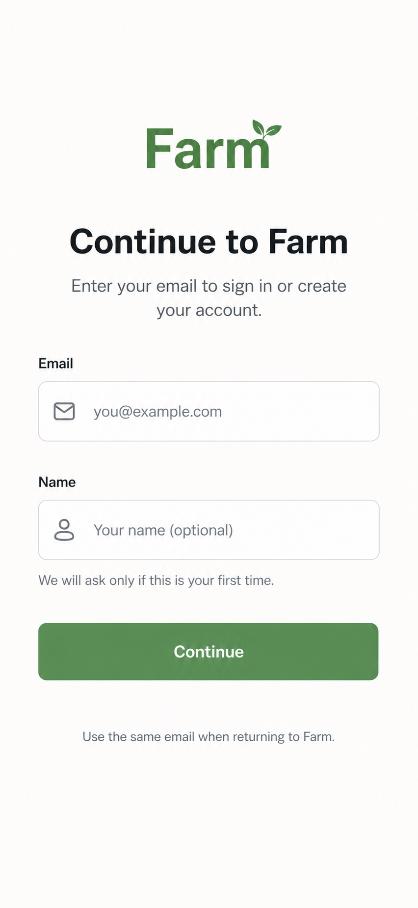

# Login

Status: Implemented locally

## Purpose

Define Farm's signed-out entry experience: one password-based flow that lets a
user continue to Farm whether they are new or returning.

This feature matters because Farm should not ask users to choose between
separate login and signup paths before it knows who they are. The first screen
should be quiet, direct, and app-like: enter email and password, provide a name
when creating a new profile, authenticate, and land in Farm.

## Current Scope

- Replace or gate the current root signed-out surface with one combined
  login/signup screen.
- Authenticate with email and password.
- Require email for every user.
- Require password for every user.
- Require name only when Farm creates a new user/profile.
- Create or reuse the app-level Farm user/profile record after auth.
- Land authenticated users on the authenticated Farm surface. For this v1,
  `/` may show a small authenticated root state until the next feature adds a
  fuller Home route.
- Use the approved mobile-first login mock as the visual target.
- Specify Convex-backed auth, data, environment, and verification expectations.

## Future Scope

- Full onboarding wizard after login.
- Farm invite preservation and acceptance after login.
- X account linking and account health checks.
- Farm creation and joining flows.
- Sign-out and account-management UI beyond what auth wiring needs.
- Dedicated auth route structure if the app outgrows the root signed-out screen.
- Additional auth methods such as passkeys or social OAuth.

## Non-Goals

- Separate login and signup screens.
- Passwordless auth, including magic links, OTP codes, and resend flows.
- Social OAuth buttons.
- X account linking or X setup.
- Farm invite acceptance in the login screen.
- Marketing landing-page content.
- Admin dashboards or broad account management.
- Manual production deploys.

## Design

- Approved mock: `docs/mocks/00_LOGIN/login-screen.png`
- Reference mocks: `docs/mocks/settings-account.png`,
  `docs/mocks/farm-management.png`, `docs/mocks/request-status.png`,
  `docs/mocks/ask-engagement.png`



Key layout decisions:

- Mobile-first phone surface with a centered, narrow form.
- Large `Farm` wordmark at the top.
- Heading: `Continue to Farm`.
- Supporting copy: `Enter your email to sign in or create your account.`
- Visible mock fields: email, then name.
- Product/auth requirements require a password. The implemented v1 screen adds
  a password field in the same input style between email and name while keeping
  the mock's narrow, quiet hierarchy.
- Primary action: `Continue`.
- Footer copy: `Use the same email when returning to Farm.`
- No X copy, Settings copy, social buttons, magic-link action, OTP code, invite action, or
  marketing hero.

Mobile behavior:

- The screen should fit comfortably in a phone viewport.
- Inputs and the primary button should have touch-friendly height and spacing.
- Text must not overflow or compress awkwardly.

Desktop behavior:

- Keep the same narrow app surface centered on the page.
- Do not expand into a dashboard or split marketing layout.

Design approval status:

- Approved by the user on 2026-05-06.

## Spec-Writing Findings

- Product and docs: `docs/features/00_LOGIN.md` uses the full
  `docs/features/PROMPT.md` structure, while the PRD remains lightweight and
  links to the feature spec. The PRD now defines login as one combined email
  password flow for new and returning users.
- Design, frontend, and shadcn: the implementation should start at
  `app/page.tsx`, use the existing `components/ui/button.tsx`, and style native
  `form`, `label`, and `input` elements with existing shadcn/Tailwind tokens
  unless a later approved change adds more shadcn components.
- Technical, data, and verification: the current Convex schema is empty, the
  app previously used plain `ConvexProvider`; implementation added Convex Auth
  provider wiring before backend identity-dependent functions run.

## Product Requirements

### User Problem

A signed-out user wants to get into Farm quickly. They may be creating an
account for the first time or returning with an existing account, but they
should not need to choose the right path up front.

### Product Goal

Provide one clear password-based continuation flow that authenticates the user,
creates or reuses the Farm profile, and sends the user into the app.

### Primary User Journey: Continue To Farm

- Entry point: signed-out user opens `/`.
- User intent: access Farm.
- Steps:
  1. User sees the approved login screen.
  2. User enters their email.
  3. User enters their password.
  4. User enters their name if they are new or if Farm needs a profile name.
  5. User presses `Continue`.
  6. System validates the form.
  7. System submits credentials through Convex Auth.
  8. System creates or reuses the Farm user/profile.
  9. System lands the authenticated user on the authenticated Farm surface.
- System behavior: derive identity from the auth session, not from client
  user IDs.
- Success outcome: user reaches the app.
- Failure outcome: user sees a concise inline error and can retry.
  Auth errors should use generic copy that does not reveal whether an email is
  registered.
- Next destination: authenticated root/home surface.

### Secondary User Journey: Returning User

- Entry point: signed-out returning user opens `/`.
- User intent: sign in with the same email and password used before.
- Steps:
  1. User enters their email.
  2. User enters their password.
  3. User leaves name empty or unchanged if the provider/profile already has it.
  4. System authenticates the credentials.
  5. System finds the existing Farm profile by stable auth identity.
  6. System lands the user in Farm.
- System behavior: do not create duplicate profiles for the same stable identity.
- Success outcome: existing profile is reused.
- Failure outcome: expired auth step, unknown account state, or backend lookup
  error is surfaced clearly.
- Next destination: authenticated root/home surface.

### Secondary User Journey: New User Profile Creation

- Entry point: signed-out new user opens `/`.
- User intent: create a Farm account without choosing a separate signup path.
- Steps:
  1. User enters email and name.
  2. User enters and submits a password.
  3. System creates a password-backed auth account.
  4. System creates a Farm user/profile linked to the stable auth identity.
  5. System lands the user in Farm.
- System behavior: name is required only for creating the first Farm profile.
- Success outcome: one app-level profile exists for the authenticated user.
- Failure outcome: missing name for a new profile, duplicate identity conflict,
  or backend write failure is shown as a recoverable error.
- Next destination: authenticated root/home surface.

### Edge Cases

- Invalid email format.
- Missing password.
- Incorrect password for an existing account.
- Password that fails provider requirements.
- Forgotten password or reset-password support.
- Empty name for a first-time profile.
- User refreshes during the auth flow.
- User authenticates but profile sync fails.
- Returning user has auth identity but missing app profile.
- Duplicate submit while auth is loading.

## UX Requirements

- Screen/page inventory:
  - Signed-out login screen at the root entry point for v1.
  - Auth loading state.
  - Auth error state.
  - Authenticated root/home state.
- Required UI states:
  - Empty form.
  - Client validation error.
  - Submitting/loading.
  - Provider/auth error.
  - Backend profile sync error.
  - Success landing state.
- Copy requirements:
  - Brand: `Farm`
  - Heading: `Continue to Farm`
  - Supporting text: `Enter your email to sign in or create your account.`
  - Email label: `Email`
  - Password label: `Password`
  - Name label: `Name`
  - Name helper: `We will ask only if this is your first time.`
  - Primary button: `Continue`
  - Footer: `Use the same email when returning to Farm.`
- Fields and validation:
  - Email is always required and must look like an email address.
  - Password is always required.
  - Name is required only when creating a new Farm profile.
  - Button is disabled while submitting.
- Loading states:
  - Button should communicate progress without shifting layout.
  - Form should prevent duplicate submission.
- Empty states:
  - The initial screen is the empty state; do not add onboarding explanation.
- Error states:
  - Place errors near the form.
  - Use concise, user-actionable copy.
- Success states:
  - Redirect directly into the app.
  - Do not show a celebratory interstitial.
- Accessibility basics:
  - Labels must be programmatically associated with inputs.
  - Errors must be announced or associated with invalid fields.
  - Tap targets must be comfortable on mobile.
  - Keyboard order must match visual order.
- Responsive behavior:
  - Mobile is the primary target.
  - Desktop remains centered and narrow.

## Technical Specification

### Frontend

- Routes/pages affected:
  - `app/page.tsx` should become or gate the signed-out login surface.
  - Later routing can extract auth into a dedicated route, but v1 does not need
    that unless implementation evidence calls for it.
- Component ownership:
  - Keep the first pass small.
  - If `app/page.tsx` becomes too large, extract a local `LoginScreen`
    component under `components/`.
- Existing shadcn components to compose:
  - Use `Button` from `components/ui/button.tsx`.
  - Use semantic native `form`, `label`, and `input` elements styled with
    existing theme tokens.
  - Do not add shadcn `input`, `label`, `field`, or auth blocks unless a later
    implementation task explicitly approves adding components.
- Theme/token changes:
  - Use `app/globals.css` for any theme-level color/radius changes.
  - Farm green should flow through `--primary`/`bg-primary` rather than one-off
    hardcoded page colors.
  - Preserve the shadcn CSS variable system from `components.json`.
- State management:
  - Local component state is enough for form fields, validation, loading, and
    error display.
  - Auth/session state should come from the auth provider wiring.
- Form handling:
  - Validate email and required password client-side before starting auth.
  - Prevent duplicate submits.
  - Keep the submit handler provider-adapter-friendly.
- Navigation:
  - Land authenticated users on the authenticated root/home surface.
  - Do not redirect to onboarding from this feature unless the later onboarding
    spec adds that gate.
- Loading/error/success handling:
  - Keep layout stable.
  - Show inline errors.
  - On success, transition into the authenticated root/home state without a
    celebratory interstitial.

### Convex / Backend

- Entities/tables created or changed:
  - Add Convex Auth internal tables through `authTables`, including the auth
    `users` table.
  - Add an app-level `profiles` table in `convex/schema.ts`, linked to the
    authenticated Convex Auth user.
- Fields and indexes:
  - See `## Data Model`.
- Queries:
  - Query the current authenticated user/profile.
  - Query by stable auth identity internally where needed.
- Mutations:
  - Create or update the current authenticated user's profile.
  - Mutation must derive identity from `ctx.auth.getUserIdentity()`.
- Actions:
  - Only add actions if Convex Auth password setup requires them.
- Auth/session mapping:
  - Use the authenticated identity from Convex.
  - Use `identity.tokenIdentifier` as the stable auth-linked key.
  - Do not accept client-supplied `userId` for authorization.
- Backend validation:
  - Validate email and name with Convex validators.
  - Use bounded reads and indexes.
  - Do not expose a public email/account-existence lookup.
- Env vars:
  - Keep current Convex env vars.
  - Add password-auth provider variables only if Convex Auth requires them
    during implementation.
- CLI checks needed:
  - `pnpm exec convex run health:ping`
  - `pnpm exec convex data profiles`
  - `pnpm exec convex run --inline-query 'await ctx.db.query("profiles").take(5)'`

### Auth

- Provider or auth mechanism:
  - Preferred v1 path: Convex Auth password login/signup.
  - The implementation pass must re-check current official Convex Auth docs
    because Convex Auth is beta and Next.js support has been evolving.
- Login/signup behavior:
  - One password-based flow handles both new and returning users.
  - New users provide name in the same flow.
  - Returning users reuse the same email/password and existing profile.
  - Do not add magic-link, OTP, or resend-code behavior.
- Session behavior:
  - Authenticated state gates the app surface.
  - Signed-out state shows the login screen.
- User entity creation/update behavior:
  - After auth, create or update one Farm `profiles` record for the stable auth
    identity.
  - Do not create duplicate Farm profiles for the same stable identity.
- Redirect/landing behavior:
  - Successful auth lands the user on the authenticated root/home surface.
  - A dedicated Home route can replace the temporary root state when that
    feature exists.
  - Failed auth returns to the login screen with an inline error.
- Local env vars:
  - Existing Convex vars from `.env.example`.
  - Password-auth vars added to `.env.local` only if Convex Auth requires them.
- Production env vars:
  - Existing `CONVEX_DEPLOY_KEY` and public Convex URL handling.
  - Password-auth vars added to Vercel Production only if implementation
    requires them.
- Verification checks:
  - Confirm `ctx.auth.getUserIdentity()` is non-null inside protected functions.
  - Confirm profile creation/update uses `identity.tokenIdentifier`.
  - Confirm signed-out users cannot call protected profile mutations.

Password reset:

- Not required for the first implementation pass unless Convex Auth's password
  provider requires it as part of the default setup.
- If deferred, the UI should show a clear inline message for forgotten-password
  attempts rather than a nonfunctional link.

### Integrations

- External email delivery:
  - Not part of this feature.
- Passwordless auth providers:
  - Not part of this feature.
- X integration:
  - Not part of this feature.

## Data Model

### `profiles`

- Purpose: app-level Farm profile linked to the authenticated identity.
- Fields:
  - `userId`: id of the Convex Auth `users` row.
  - `tokenIdentifier`: string; stable auth identity key.
  - `email`: string; normalized email address.
  - `name`: string; display name for Farm.
  - `createdAt`: number; creation timestamp.
  - `updatedAt`: number; last profile update timestamp.
- Indexes:
  - `by_userId`
  - `by_tokenIdentifier`
  - `by_email`
- Relationships:
  - Future Farms, accounts, engagement requests, and memberships should refer
    to this app-level profile rather than raw auth provider records.
- Creation/update lifecycle:
  - Create after first successful authentication.
  - Reuse on subsequent logins for the same stable auth identity.
  - Patch `name` only when user/profile edit behavior is explicitly added.
- Example record shape:

```ts
{
  userId: "jd7...",
  tokenIdentifier: "provider|stable-subject",
  email: "user@example.com",
  name: "Ada Lovelace",
  createdAt: 1778067600000,
  updatedAt: 1778067600000,
}
```

## Development Plan

Sequential implementation plan:

1. Confirm scope remains combined email login/signup only.
2. Verify the approved mock path and keep it referenced in this spec.
3. Check current Convex Auth docs and repo Convex guidance before editing auth
   code.
4. Add or update theme tokens in `app/globals.css` only if needed to match the
   mock through shadcn variables.
5. Build the signed-out login UI at the root entry point using existing `Button`
   and semantic form controls.
6. Add Convex Auth setup and auth-aware client provider wiring.
7. Add the app-level `profiles` table, indexes, and profile sync/query
   functions.
8. Wire form submission to Convex Auth password login/signup.
9. Add loading, error, duplicate-submit, and authenticated landing behavior.
10. Run local visual, flow, Convex, and spec-adherence verification.
11. Clean up run-specific leftovers.

Parallel implementation plan for build mode:

1. Design/theme/mock fidelity owner
   - Owns `app/globals.css`, visual spacing, color tokens, and mock comparison.
2. Frontend route and component owner
   - Owns `app/page.tsx` and any extracted login component.
3. Convex/auth/data owner
   - Owns Convex Auth setup, `convex/schema.ts`, auth-aware provider wiring,
     and profile functions.
4. Verification, browser testing, backend checks, and cleanup owner
   - Owns in-app browser runs, Convex CLI checks, local command output,
     production checklist when needed, and cleanup.

Tell building subagents:

- They are not alone in the codebase.
- They must not revert others' edits.
- They must adapt to nearby changes.
- They must report changed files and verification results.

The main agent owns final integration.

## Acceptance Criteria

- [ ] Signed-out users see one combined email login/signup screen.
- [ ] The screen matches `docs/mocks/00_LOGIN/login-screen.png` closely.
- [ ] Email is required for all users.
- [ ] Name is required only for new Farm profile creation.
- [ ] There is no separate signup screen.
- [ ] Password is required for login and signup.
- [ ] Password reset is either implemented through Convex Auth or explicitly
      deferred with no dead-end UI.
- [ ] There is no social OAuth button.
- [ ] There is no magic-link, OTP, or resend-code flow.
- [ ] There is no X linking copy or action.
- [ ] Invalid email submissions show an inline error.
- [ ] Duplicate submit is prevented during loading.
- [ ] Returning users can authenticate with the same email and password.
- [ ] New users can create exactly one app-level Farm profile.
- [ ] Authenticated users land on the authenticated Farm surface.
- [ ] Convex receives authenticated identity server-side.
- [ ] Profile ownership uses `identity.tokenIdentifier`.
- [ ] Backend functions do not trust client-supplied user IDs.
- [ ] The UI/backend do not expose a public account-existence probe.
- [ ] Mobile layout is touch-friendly and fits without awkward overflow.
- [ ] Desktop layout remains narrow and app-like.
- [ ] Labels, errors, and focus order meet basic accessibility requirements.
- [ ] No unrelated product flows are introduced.

## Verification Plan

The implementation agent must verify the feature with multiple testing modes.

### Parallel Verification Agents

After implementation, launch separate verification agents for:

1. Visual testing against `docs/mocks/00_LOGIN/login-screen.png`.
2. Flow and end-to-end browser testing.
3. Convex/backend/data verification.
4. Spec adherence review.

Each verification agent must report:

- What it tested.
- Commands, browser flows, or backend checks it ran.
- Pass/fail result.
- Issues found.
- Recommended fixes.

The main agent owns integrating fixes and rerunning relevant checks.

### Visual Testing

Use the in-app browser on localhost.

Check:

- Layout matches the approved mock.
- Spacing, typography, and color match the mock closely.
- Mobile viewport works.
- Desktop viewport remains narrow.
- Loading, error, and success states do not shift layout unexpectedly.
- Text does not overflow or overlap.

### Flow Testing

Use the in-app browser to click through the user journey.

Check:

- Signed-out entry point at `/`.
- Email validation.
- Password required validation.
- Name behavior for new users.
- `Continue` action.
- Loading/disabled button behavior.
- Auth error behavior.
- Success landing/navigation behavior.
- Refresh behavior before and after auth.

### End-To-End Testing

Run the real feature path end to end.

Check:

- Start from a signed-out browser state.
- Authenticate with a test email and password.
- Create a new profile with name.
- Confirm the app reaches the expected authenticated screen.
- Sign out if sign-out exists in the implementation.
- Sign back in with the same email and password.
- Confirm no duplicate profile is created.

### Convex / Backend Testing

Use Convex skills and CLI checks.

Commands/checks:

- `pnpm exec convex dev`
- `pnpm exec convex run health:ping`
- `pnpm exec convex data profiles`
- `pnpm exec convex run --inline-query 'await ctx.db.query("profiles").take(5)'`
- Confirm expected entities exist.
- Confirm fields are populated correctly.
- Confirm indexes support the intended lookups.
- Confirm mutations validate input.
- Confirm auth identity maps correctly to app user records.
- Confirm local env vars work.
- Confirm production env vars only when production verification is in scope.

### Spec Adherence Testing

Use a dedicated verification agent to compare the implementation against this
spec.

Check:

- Every current-scope requirement is implemented.
- Every acceptance criterion is satisfied or explicitly marked as deferred.
- The approved mock is reflected in the UI.
- Non-goals were not accidentally implemented.
- Future-scope notes stayed out of the current implementation.
- Technical requirements were followed.
- Required verification steps were actually run.
- Known deviations are documented with a reason.

### Production Verification

Include only when the implementation is pushed or production behavior is
explicitly in scope.

Check:

- Open `https://spcfarm.vercel.app`.
- Confirm production Convex deployment `production-eu` is healthy with
  `pnpm exec convex run --deployment production-eu health:ping`.
- Confirm production password-auth env vars are present when required.
- Complete the visible user flow in production with a production-safe test
  email.

Do not manually deploy unless explicitly asked. Trust the repo's automatic
production deployment after GitHub push, then verify production status if
needed.

## Push / Completion Criteria

When implementation is requested, the work is not complete until:

- The approved mock is referenced in this spec.
- The implementation matches the mock closely.
- Local visual verification passes.
- Flow and end-to-end verification pass.
- Backend verification passes.
- Spec adherence verification passes.
- Production verification is done when production behavior is in scope.
- Run-specific leftovers are cleaned up.
- Changes are committed and pushed when the user asks for push.

## Open Questions

- None that block this spec.

Implementation may still need a human decision if the current Convex Auth
password setup requires a production secret, callback URL, or other deployment
setting.

## Assumptions

- The implementation creates a small authenticated root/home state because the
  app does not yet have a separate post-login route.
- The latest user instruction supersedes earlier onboarding notes: this feature
  is only login.
- Login and signup are one combined flow.
- X account linking is not part of login.
- Convex remains the backend.
- Convex Auth password login/signup is the preferred v1 auth direction unless
  current official docs block that choice during implementation.
- `docs/mocks/00_LOGIN/login-screen.png` is the canonical approved mock path
  for this spec.

## Amendments

### 2026-05-06: Prompt-Format Rewrite

Rewrote the login spec into the `docs/features/PROMPT.md` structure, moved the
canonical mock reference to `docs/mocks/00_LOGIN/login-screen.png`, and kept the
scope focused on one combined email login/signup flow.

### 2026-05-06: Password Auth Scope

Changed v1 login from passwordless email auth to password-based Convex Auth.
Magic links, OTP codes, resend flows, and the legacy flat mock path are out of
scope.

### 2026-05-06: Local Implementation

Implemented the combined password login/signup screen, Convex Auth wiring,
`profiles` table, profile sync functions, shadcn theme tokens, local/dev auth
env setup, and production Convex Auth env setup for deployment
`merry-walrus-605`.
