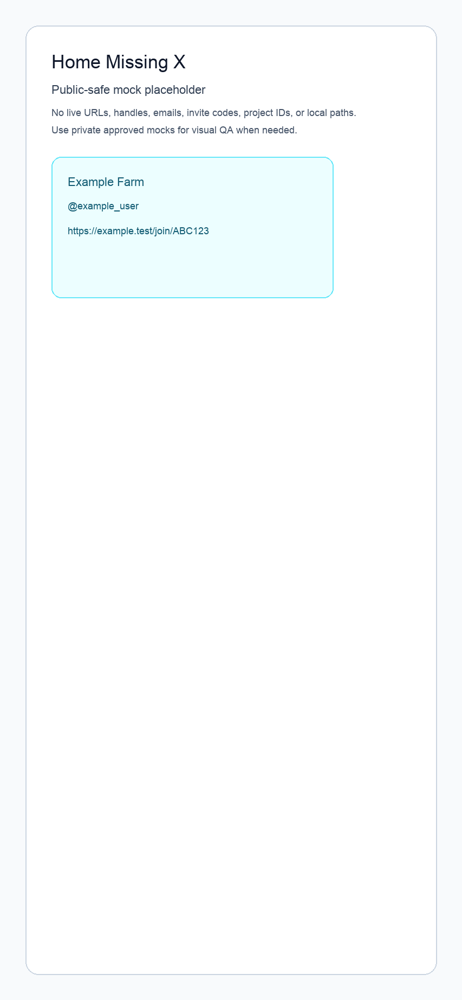
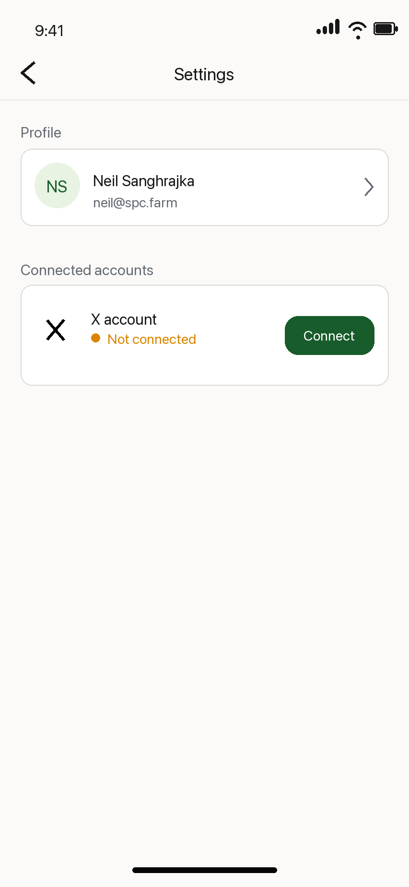
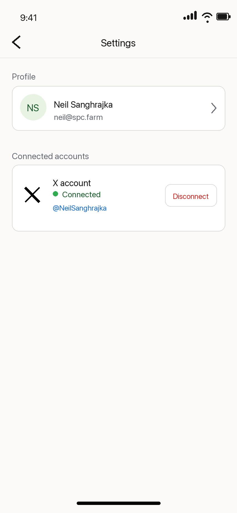

# X Login

Status: Draft

## Purpose

Define the first authenticated experience after Farm login: the user lands on
Home, sees the existing app surface, and is guided to connect their X account
before they can request engagement.

This feature is called X Login in product shorthand, but it is not the primary
Farm sign-in flow. Farm app login remains password-based in
`docs/features/00_LOGIN.md`. This spec covers linking and unlinking a user's X
account through official X OAuth, storing the linked account server-side, and
using that linked state to gate engagement actions in the app.

## Current Scope

- Use the approved X linking mocks under `docs/mocks/01_X_LOGIN/` as the
  implementation reference.
- After password login, land the user on Home.
- If the user has not linked X, make the Home request CTA read
  `Link X account`.
- The Home `Link X account` CTA sends the user to Settings.
- Settings shows the X account area and starts official X OAuth.
- Store one or more linked external account records for the authenticated Farm
  user, starting with X.
- Store X OAuth token material securely enough for server-side official API
  calls.
- Show linked, unlinked, expired, and revoked account states.
- Allow the user to disconnect their X account.
- Disable request-engagement actions until an eligible X account is linked.

## Future Scope

- A richer onboarding wizard.
- Invite acceptance and Farm joining from invite links.
- Farm creation, joining, leaving, or membership-management UX.
- Request engagement implementation details beyond blocking when X is missing.
- Background token refresh strategy beyond what OAuth setup requires.
- Multiple social platforms.
- Additional X engagement actions beyond likes.
- Admin dashboards or support tooling.

## Non-Goals

- Replacing Farm password login with X login.
- Requiring X linking during account creation.
- Designing new Settings screens from scratch.
- Designing a full invite-acceptance flow.
- Building Farm join/leave flows in this feature.
- Requesting broad X permissions such as posting arbitrary content, DMs,
  passwords, or unrelated account access.
- Browser automation, scraping, or non-official X automation.
- Manual production deploys.

## Design

- Base app reference mocks:
  - `docs/mocks/ask-engagement.png`
  - `docs/mocks/request-status.png`
- Approved X linking implementation mocks:
  - `docs/mocks/01_X_LOGIN/home-missing-x.png`
  - `docs/mocks/01_X_LOGIN/settings-x-unlinked.png`
  - `docs/mocks/01_X_LOGIN/settings-x-linked.png`







Key layout decisions:

- Home still includes the `Request X Engagement` surface, but the missing-X
  version uses the main request CTA for X setup.
- Home keeps the Settings gear entry point from the existing mock.
- If X is missing, the post URL field, Farm selector, and request button should
  communicate that setup is required before engagement can be requested.
- Do not show a separate missing-X setup card on Home. The main request button
  should become `Link X account`, include a warning icon, and route to Settings.
- Home should not show badges such as `Official X API only`; keep the missing-X
  state clean and action-oriented.
- Settings keeps the existing connected-account treatment and should support
  both unlinked and linked states in the same section.
- The linked Settings state should show only the connected X account, handle,
  and `Disconnect`; do not add secondary implementation cards or status badges,
  account-detail rows, endpoint verification, `Home is unblocked`, or a bottom
  `Back to Home` button.
- Before sending the user to X, Settings shows a compact shadcn Dialog that
  explains X requires read scopes for the user-context like flow, Farm uses
  them only to identify the linked X account and like/unlike submitted post
  URLs, and Farm does not request DM, follow, bookmark, email, password, or
  arbitrary posting access.
- Use the official black X mark treatment in the X account row.
- Use shadcn/Tailwind tokens from `app/globals.css`; avoid one-off page colors
  for foundational surfaces.
- Use shadcn primitives for the UI surfaces instead of hand-rolling local
  equivalents. If a needed primitive is missing from `components/ui`, add it
  through the shadcn CLI with `pnpm`.

Mobile behavior:

- Mobile is the primary target.
- The missing-X CTA must remain visible without hiding the main Home context.
- Tap targets must stay comfortable.

Desktop behavior:

- Keep the same narrow app surface centered on the page.
- Do not expand this into a dashboard.

Design approval status:

- Approved X linking mocks are in `docs/mocks/01_X_LOGIN/`.
- These mocks supersede earlier X linking drafts that showed `Official X OAuth`,
  OAuth scopes, endpoint verification, `Home is unblocked`, `Official X API
only`, X user ID/detail rows, or bottom `Back to Home` actions.
- Implementation should match the approved mocks unless the user explicitly
  requests another mock revision before build.

## Product Requirements

### User Problem

A user who has signed into Farm may not yet have connected X. They need to
understand why engagement actions are blocked and have a direct path to connect
X without being forced through a broad onboarding flow.

### Product Goal

Make X account connection the first useful setup step after login, while keeping
Home recognizable as the app's main working surface.

### Primary User Journey: Link X From Home

- Entry point: authenticated user lands on Home after password login.
- User intent: start using Farm.
- Steps:
  1. User sees the Home screen.
  2. System checks whether the authenticated Farm user has an active linked X
     account.
  3. If X is missing, Home disables the post/Farm controls and changes the main
     request CTA to `Link X account`.
  4. User taps `Link X account`.
  5. System routes the user to Settings.
  6. User starts official X OAuth.
  7. User authorizes Farm on X.
  8. System stores the linked X account and token material.
  9. User returns to Farm with X marked as connected.
- System behavior: all account ownership is derived from the authenticated
  Convex identity, not from client-provided user IDs.
- Success outcome: Home allows engagement request actions that require X.
- Failure outcome: user remains in Settings with a concise error and can retry.
- Next destination: Home or Settings, depending on where OAuth returns.

### Secondary User Journey: Already Linked

- Entry point: authenticated user lands on Home.
- User intent: request engagement or inspect current app state.
- Steps:
  1. System loads the user's linked account state.
  2. Home does not show the missing-X `Link X account` CTA.
  3. Engagement actions are available subject to the user's Farms and request
     validation.
- Success outcome: the user can continue to the normal Home workflow.
- Failure outcome: if the token is expired or revoked, the account state changes
  to needs reconnect and Home returns to the `Link X account` CTA state.
- Next destination: Home.

### Secondary User Journey: Disconnect X

- Entry point: authenticated user opens Settings.
- User intent: remove Farm's access to their X account.
- Steps:
  1. User sees the linked X account.
  2. User taps disconnect.
  3. System confirms or performs the disconnect action.
  4. System marks the account disconnected and removes or invalidates stored
     token material.
  5. Home returns to the missing-X blocked state.
- Success outcome: Farm no longer attempts X actions for that account.
- Failure outcome: user sees a recoverable error.
- Next destination: Settings.

### Edge Cases

- User cancels the X OAuth flow.
- OAuth callback is missing state or code.
- OAuth state does not match the pending session.
- X returns denied access.
- X token exchange fails.
- X account is already linked to the same Farm user.
- X account is already linked to a different Farm user.
- Stored token is expired, revoked, or missing required scope.
- User disconnects while an engagement request is pending.
- User has no Farms yet.
- User has an invite pending, but Farm joining is deferred to onboarding/farm
  specs.

## UX Requirements

- Screen/page inventory:
  - Home with linked-X-ready state.
  - Home with missing-X blocked state.
  - Settings with unlinked X account state.
  - Settings with linked X account state.
  - Settings disconnecting state.
  - OAuth redirect/loading state.
  - OAuth error state.
- Required UI states:
  - Loading linked account state.
  - No X linked.
  - X linking in progress.
  - X linked.
  - X token needs reconnect.
  - X disconnecting.
  - X disconnect failed.
- Copy requirements:
  - Home missing-X CTA should be direct and operational, not onboarding-themed.
  - Use `Link` for the Settings action that starts the pre-X confirmation.
  - Use `Reconnect X account` when a previously linked account needs repair.
  - Use `Disconnect` in Settings for unlinking.
  - The pre-X dialog may mention official X authorization and the exact limited
    permission shape. Do not add persistent implementation proof copy on the
    user-facing Settings screen, including endpoint names, app IDs, or badges.
- Blocking behavior:
  - Request engagement submission is disabled until X is linked.
  - Missing-X Home should prioritize the request form and use its main CTA for
    X account setup.
  - Do not block basic navigation to Settings or Farm surfaces.
- Accessibility basics:
  - Disabled controls need nearby explanatory text.
  - Loading and error states must be announced or visible near the relevant
    action.
  - OAuth actions must be keyboard reachable.

## Technical Specification

### Required Skills And Plugins

Implementation agents must use these repo skills/plugins before writing or
changing code for this feature:

- `$X` at `.agents/skills/x/SKILL.md` for X
  OAuth, user-context authentication, scopes, rate limits, endpoint behavior,
  and official API verification.
- `$convex` at `.agents/skills/convex/SKILL.md`
  for routing to the right Convex workflow. For this feature, expect to use the
  more specific auth/schema guidance when adding account tables, auth-owned
  queries, mutations, actions, or HTTP callbacks.
- `@vercel` / Vercel plugin when implementation needs current Next.js/Vercel
  guidance for route handlers, environment variables, production deployment
  behavior, or deployment verification. If the plugin docs tool is unavailable,
  use the repo-local Vercel guidance in `docs/CONVEX.md`, `AGENTS.md`, and CLI
  help instead of guessing.
- `$frontend-skill` and `$vercel-plugin/shadcn` for any Home or Settings UI
  changes. Use shadcn primitives wherever they fit; add missing primitives with
  `pnpm` and the shadcn CLI instead of creating custom replacements.

Do not rely on memory for X, Convex, or Vercel behavior when implementing this
feature. Re-open the relevant skill and use current official docs/CLI output
where the behavior affects auth, tokens, billing, deployment, or production
configuration.

### Frontend

- Routes/pages affected:
  - Home route or authenticated root surface.
  - Settings route or Settings screen.
  - OAuth callback route if the callback is handled by Next.js.
- Component ownership:
  - Prefer page-level composition from shadcn primitives over new reusable
    custom UI components.
  - Keep Settings X account UI local to Settings unless reused elsewhere.
- shadcn components to compose:
  - Use `Button` for actions.
  - Use `Card` for account/setup surfaces.
  - Use `Badge` for connected/not-connected states.
  - Use `AlertDialog` for disconnect confirmation if confirmation is needed.
  - Use `Input` and `Label` for request-form fields if those fields are touched.
  - Use `Alert` for recoverable OAuth errors and `Skeleton` for loading states
    if those states are visible.
  - Add missing shadcn primitives with `pnpm exec shadcn add ...` or the repo's
    existing pnpm-based shadcn command. Do not create custom local replacements
    for primitives shadcn already provides.
- State management:
  - Linked-account status should come from Convex queries.
  - OAuth start/disconnect actions should call backend functions or API routes,
    not trust client-only state.
- Navigation:
  - Home setup action routes to Settings.
  - Settings starts OAuth and returns to a stable app destination after success
    or failure.
- Loading/error/success handling:
  - Keep button dimensions stable while loading.
  - Show concise inline errors.
  - Avoid modal-heavy flows for v1.
  - After a successful OAuth callback, return to Settings or Home without a
    celebratory interstitial.
  - Use the existing Settings back arrow for navigation; do not add a bottom
    `Back to Home` button to the linked-account state.

### Route And Runtime Boundary

Chosen implementation boundary:

- Next.js owns `/callback` only as an OAuth redirect shim. It forwards X's
  `code`, `state`, and error query params to the Convex HTTP callback.
- Convex owns the actual token exchange, linked-account write, token storage,
  and final redirect back to Farm.
- Do not duplicate token-exchange logic across Next.js and Convex.
- Because the current X app is configured as `Native App`, it is a public PKCE
  client. `X_CLIENT_ID` is required. `X_CLIENT_SECRET` is optional and should be
  used only if the app is later changed to a confidential client type.

### Convex / Backend

Read `docs/CONVEX.md` and `convex/_generated/ai/guidelines.md` before editing
backend code.

Required entities:

- Add an `accounts` table for linked external accounts.
- Link each account to the authenticated Farm profile or Convex Auth user.
- Support provider `x` as the initial provider.

Recommended account fields:

- `userId`: Convex Auth user id.
- `profileId`: Farm profile id if needed by product queries.
- `provider`: `"x"`.
- `providerAccountId`: stable X user id.
- `username`: X handle when available.
- `displayName`: X display name when available.
- `status`: `"linked" | "needs_reconnect" | "disconnected"`.
- `scopes`: granted OAuth scopes.
- `encryptedAccessToken`: AES-GCM encrypted token material.
- `encryptedRefreshToken`: AES-GCM encrypted token material when issued.
- `expiresAt`: token expiry timestamp when applicable.
- `createdAt`, `updatedAt`, `disconnectedAt`.

Recommended indexes:

- `by_userId_and_provider`
- `by_provider_and_providerAccountId`
- `by_status`

Required backend functions or endpoints:

- Query current user's linked account state.
- Start X OAuth and create a signed state value.
- Handle X OAuth callback and exchange code for token material.
- Upsert the X account for the authenticated user.
- Disconnect the current user's X account.
- Mark account as needs reconnect when token validation or an X API call proves
  the token is invalid.

Backend requirements:

- Never accept client-provided user IDs for ownership.
- Use authenticated identity from Convex Auth.
- Validate OAuth state before exchanging tokens.
- Store only the minimum X account metadata needed by the product.
- Keep token material server-side only.
- Encrypt token material before storing it in Convex with
  `X_TOKEN_ENCRYPTION_KEY`.
- Return redacted account state to the client.
- Do not expose `X_CLIENT_SECRET`, access tokens, refresh tokens, or raw OAuth
  responses to the browser.

### Auth

- Farm app login stays in `docs/features/00_LOGIN.md`.
- X OAuth is account linking for authenticated Farm users.
- Use official X OAuth with
  `tweet.read users.read like.write offline.access`.
- X requires `tweet.read` and `users.read` for the user-context like flow and
  account id resolution. Farm uses those read scopes only to identify the linked
  X account and like or unlike submitted post URLs.
- The OAuth flow must not grant arbitrary posting, DM, follow, bookmark, email,
  password, or unrelated account access.
- A user can unlink X without deleting their Farm account.

### X API

Use the X skill and current official X docs before implementation.

Developer setup:

- Keep live X account handles, authenticated X user IDs, developer account IDs,
  app IDs, app names, billing details, and dashboard URLs in private env or an
  untracked operator runbook.
- Store the app ID in `X_APP_ID` and enrolled/developer account ID in
  `X_ENROLLED_ACCOUNT_ID`; do not hardcode those values in docs or code.
- Configure callback URLs in the X Developer Console from `X_REDIRECT_URI`.
- Set `NEXT_PUBLIC_APP_URL` to the app origin that should receive users after
  the Convex OAuth callback completes.
- Scopes requested for the minimum official X like flow:
  `tweet.read users.read like.write offline.access`.

Sensitive credential handling:

- OAuth 2.0 Client ID exists in the console and can be used in code through an
  environment variable.
- The current `Native App` setup is a public PKCE client, so token exchange can
  use `client_id` in the request body without a client secret.
- If the app is later changed to a confidential client type, retrieve or
  regenerate the OAuth 2.0 Client Secret from the X Developer Console and store
  it only in server-side env.
- Use these environment variables for X credentials and production callback
  configuration:
  - `X_CLIENT_ID`
  - `X_CLIENT_SECRET` when using a confidential client
  - `X_REDIRECT_URI`
  - `X_OAUTH_SCOPES`
  - `X_APP_ID`
  - `X_ENROLLED_ACCOUNT_ID`
- Store server-only X values on Convex because Convex handles token exchange.
  Vercel only needs public app/Convex URLs for the `/callback` redirect shim.

Required production env status:

- Vercel Production has:
  - `CONVEX_SITE_URL`
  - `CONVEX_DEPLOY_KEY`
  - `NEXT_PUBLIC_APP_URL`
  - `NEXT_PUBLIC_CONVEX_URL` injected by the Convex deploy build wrapper, not
    stored as a persistent Vercel env var.
- Convex production has:
  - `NEXT_PUBLIC_APP_URL`
  - `X_CLIENT_ID`
  - `X_REDIRECT_URI`
  - `X_OAUTH_SCOPES`
  - `X_APP_ID`
  - `X_ENROLLED_ACCOUNT_ID`
  - `X_TOKEN_ENCRYPTION_KEY`
- Convex dev deployment has local OAuth values for localhost testing.
- `X_CLIENT_SECRET` is not required for the current public PKCE app type.
- Do not keep X OAuth credentials or X app/account metadata in Vercel; Convex
  handles token exchange and token encryption.
- X Developer Console callback URLs should match `X_REDIRECT_URI` for each
  environment.

Required dashboard / env setup before build:

1. Use the X Developer Console only when CLI/local automation cannot complete
   the action.
2. Confirm the callback URL in `X_REDIRECT_URI` is registered for the X app.
3. Open the configured app's `Keys & Tokens` view only to verify or rotate
   credentials.
4. Confirm OAuth 2.0 `X_CLIENT_ID` is set on Convex.
5. Confirm `X_TOKEN_ENCRYPTION_KEY` is set on Convex.
6. Set `X_CLIENT_SECRET` on Convex only if the X app is changed from Native App
   to a confidential client type.
7. Use Vercel CLI and Convex CLI for env updates whenever possible.
8. Do not commit, print, or paste the client secret or token encryption key into
   docs, code, logs, or chat.

Known working OAuth flow:

1. Generate `code_verifier`, `code_challenge`, and `state`.
2. Start a callback endpoint at `http://127.0.0.1:3000/callback` for local
   testing.
3. Send the user to `https://x.com/i/oauth2/authorize`.
4. User authorizes the configured X app.
5. X redirects to the callback with `code`.
6. Exchange the code at `POST https://api.x.com/2/oauth2/token`.
7. Resolve the authenticated X user id with `/2/users/me`; X requires
   `tweet.read users.read` for that user-context identity call.
8. Store the X account id and token material.

Known working API calls:

- Token exchange: `POST https://api.x.com/2/oauth2/token`.
- Authenticated user lookup uses `GET /2/users/me`; Farm uses it only to
  resolve the linked account id required by X's like endpoint.
- Like post:
  `POST https://api.x.com/2/users/<x-user-id>/likes`.
- Like body:

```json
{ "tweet_id": "<post_id>" }
```

Operational guardrails:

- Do not use app-only bearer tokens for likes. Likes require user-context OAuth.
- The like endpoint accepts numeric post IDs, not full X URLs. Extract the
  numeric ID after `/status/` and pass it as `tweet_id`.
- If the like call fails with `402 CreditsDepleted`, check Developer Console
  billing/credits.
- If the like call fails with `403`, check scopes, app permissions, user auth
  settings, and current X write-access rules.
- Use the X Developer Console only when CLIs or local scripts cannot complete
  the needed action.

Implementation agents should verify:

- OAuth method and PKCE/client-secret requirements for the chosen X app type.
- Confirm the configured scopes remain
  `tweet.read users.read like.write offline.access`.
- Whether refresh tokens are issued for the chosen OAuth configuration.
- Rate-limit and error behavior for token validation and liking.

## Development Plan

1. Re-open the required skills/plugins listed above.
2. Confirm current routing shape for authenticated Home and Settings.
3. Confirm whether Next.js or Convex owns the OAuth callback.
4. Add or verify the required X env vars for the chosen runtime.
5. Add the production callback URL to the X Developer Console if it is not
   already configured.
6. Add the `accounts` schema and indexes.
7. Add Convex functions/endpoints for linked account state.
8. Add OAuth start/callback handling.
9. Add Settings linked/unlinked UI using the approved X linking mocks.
10. Add Home missing-X blocked state using the approved X linking mock.
11. Add disconnect behavior.
12. Verify local auth, OAuth redirects, linked state, disconnect, and Home
    gating.

## Verification Plan

- Run `pnpm lint`.
- Run `pnpm typecheck`.
- Run Convex checks with the CLI where applicable:
  - `pnpm exec convex --help` when stuck.
  - `pnpm exec convex run health:ping`.
- Confirm env/config before OAuth testing:
  - `X_CLIENT_ID` is set in the runtime handling OAuth.
  - `X_CLIENT_SECRET` is set only if using a confidential X client.
  - `X_TOKEN_ENCRYPTION_KEY` is set in the runtime handling OAuth.
  - `X_REDIRECT_URI` matches an allowed X Developer Console callback.
  - `X_OAUTH_SCOPES` contains
    `tweet.read users.read like.write offline.access`.
- Use the in-app browser for localhost verification:
  - Sign in.
  - Land on Home.
  - Confirm Home shows `Link X account` instead of a separate missing-X prompt.
  - Navigate to Settings.
  - Start OAuth or verify the configured local callback behavior.
  - Confirm linked state appears after a successful callback.
  - Disconnect X.
  - Confirm Home returns to the blocked state.
- Production deploys happen automatically on GitHub push. Do not manually deploy
  unless explicitly asked.
- Production verification after push:
  - Open `$NEXT_PUBLIC_APP_URL`.
  - Sign in.
  - Confirm missing-X Home shows `Link X account`.
  - Start X OAuth from Settings.
  - Confirm OAuth returns to Farm.
  - Confirm linked X account appears without exposing token material.
  - Disconnect X and confirm Home returns to the blocked state.

## Acceptance Criteria

- After Farm login, the user lands on Home.
- If the user has no active linked X account, Home shows `Link X account` as
  the main CTA.
- Missing-X Home state prevents request engagement submission.
- The Home `Link X account` CTA routes the user to Settings.
- Settings can start official X OAuth.
- Settings shows the pre-X limited-access dialog before redirecting to X.
- A successful OAuth callback creates or updates an X account entity.
- Linked X state is visible in Settings.
- Settings linked state contains only the connected X account summary and
  disconnect action.
- The client never receives raw token material.
- The user can disconnect X.
- Disconnecting X returns Home to the missing-X blocked state.
- Invite acceptance and broader onboarding remain out of scope.
