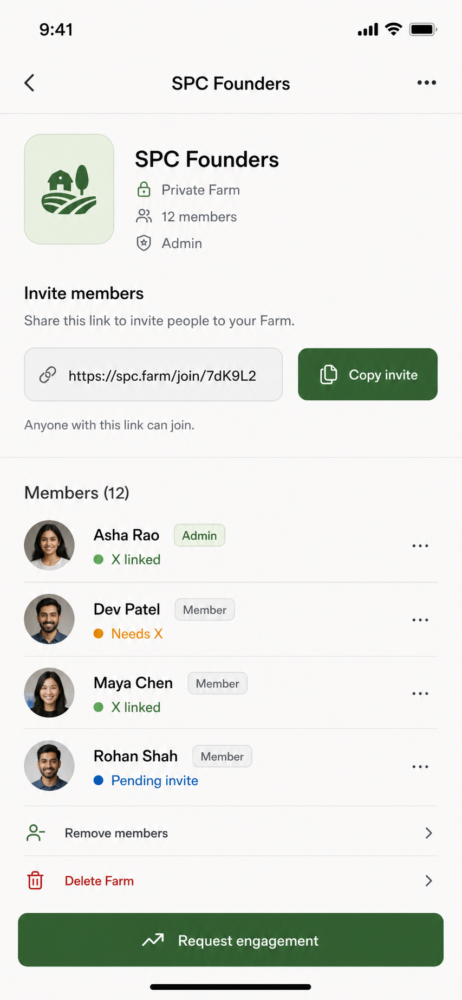
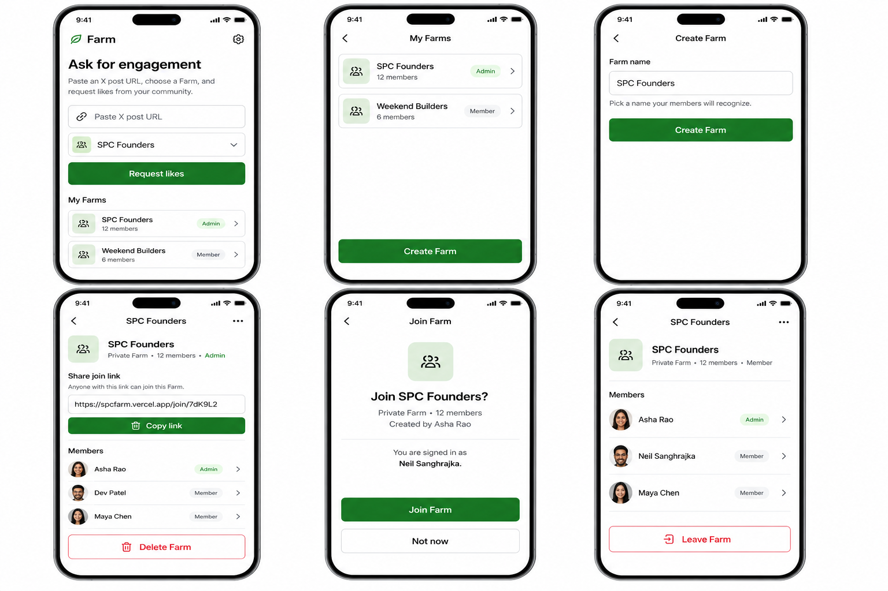
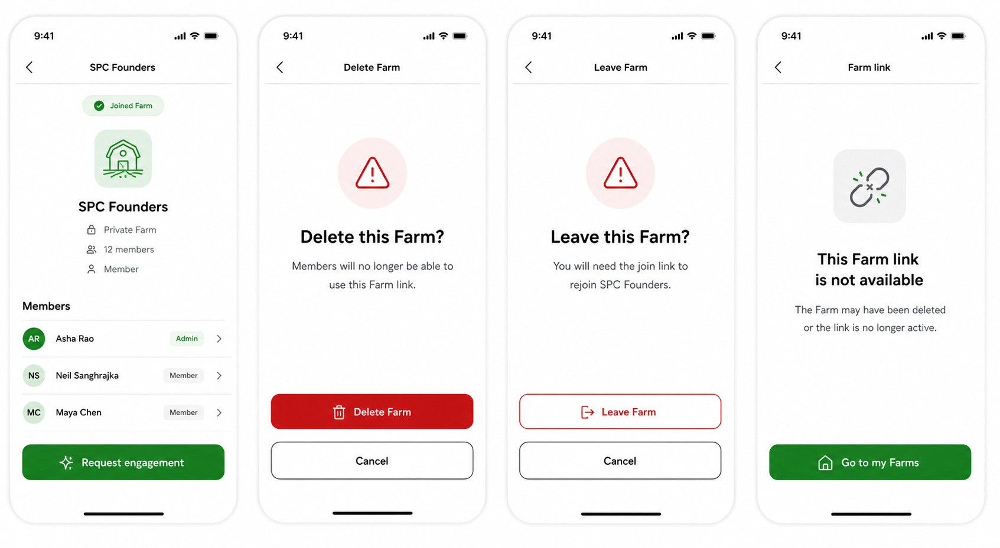

# Farm

Status: Draft

## Purpose

Define the Farm UI flow for authenticated users who can create a Farm, share a
join link, join a Farm from that link, view their Farms, manage a Farm, leave a
Farm, or delete a Farm when they are the Farm admin.

This feature matters because Farms are the core private community unit in the
product. Before engagement requests, automation, or X-linked eligibility can be
useful, a user needs a simple way to create the group, invite people with one
copyable URL, and confirm that members can reach the right Farm screen after
joining.

## Current Scope

- Authenticated users can see their Farms from Home.
- Settings includes a `Manage my Farms` entry that routes to the Farm list.
- Users can open a Farm detail screen from Home, Settings, or a joined invite.
- Users can create a Farm from the Farm list.
- The Farm creator becomes the only admin for v1.
- Admins see the same Farm detail screen as members, plus admin-only controls.
- Admins can copy one reusable join URL for the Farm.
- Admins can delete a Farm.
- Non-admin members can leave a Farm.
- Users can open a join URL, review the Farm details, and tap a positive action
  to join.
- Signed-out users who open a join URL can log in or sign up, then return to
  the join confirmation.
- Existing mocks remain the visual source of truth for layout, density,
  typography, icons, and control treatment.

## Future Scope

- X/Twitter linked-account requirements for joining or active membership.
- Grayed-out or inactive member states based on X/Twitter account status.
- Member removal by admins.
- Multiple admins, admin transfer, or admin role management.
- Invite link expiry, revocation, rotation, or per-person invites.
- Separate invite-member forms or manual email invites.
- Public Farm discovery.
- Farm request settings, approval settings, or who-can-request controls.
- Engagement request creation, validation, and automation.
- Request-status history inside Farm detail beyond links to existing request
  status flows.
- Notifications when someone joins, leaves, or deletes a Farm.

## Non-Goals

- Do not add an invite-member screen.
- Do not add a separate `Invite links` management area in Settings for v1.
- Do not require X/Twitter linking before Farm creation or joining.
- Do not show X-linked, Needs X, Pending invite, or Twitter-derived inactive
  member states as product behavior in this feature.
- Do not implement engagement requests or automatic likes in this feature.
- Do not build a broad desktop admin dashboard.
- Do not introduce new shadcn components unless they already exist in the repo
  when implementation begins.
- Do not manually deploy; production deploys are automatic on GitHub push.

## Design

### Existing Reference Mocks

- Primary Farm detail reference: `docs/mocks/farm-management.png`
- Home reference: `docs/mocks/ask-engagement.png`
- Settings reference: `docs/mocks/settings-account.png`
- Request status reference for downstream navigation:
  `docs/mocks/request-status.png`

### Approved Farm Mocks

The Farm mock packet was generated and approved by the user on 2026-05-06.
Implementation should use these approved mock sheets as the visual target:

- Approved primary flow mock:
  `docs/mocks/03_FARM/farm-flow-main.png`
- Approved confirmation states mock:
  `docs/mocks/03_FARM/farm-flow-confirmations.png`

The approved sheets cover this screen packet:

1. `home-my-farms.png`
   - Home screen with a `My Farms` list.
   - Keep the existing Home header, Settings gear, large title, URL input, Farm
     selector treatment, and green primary action from
     `docs/mocks/ask-engagement.png`.
   - Add a compact `My Farms` section that lists Farm names as tappable rows.
   - Each Farm row shows name, member count, role badge when admin, and chevron.
   - Empty state copy: `No Farms yet`.
   - Empty state primary action: `Create Farm`.
2. `farms-list.png`
   - Manage Farms screen reached from Settings.
   - Top nav: back button, centered title `My Farms`.
   - List all Farms the user belongs to.
   - Primary action: `Create Farm`.
   - Empty state: `Create your first Farm`.
3. `create-farm.png`
   - Create Farm form.
   - One required field: Farm name.
   - Primary action: `Create Farm`.
   - Secondary action: back/cancel.
   - Success routes to Farm detail with the join link visible.
4. `farm-detail-admin.png`
   - Based on `docs/mocks/farm-management.png`.
   - Header shows Farm name, privacy, member count, and `Admin`.
   - Invite area is renamed from `Invite members` to `Share join link`.
   - No invite-member form.
   - Shows copyable join URL and `Copy link`.
   - Shows member list.
   - Admin-only destructive row: `Delete Farm`.
   - Hide `Remove members` for v1 unless product re-adds member removal.
5. `farm-detail-member.png`
   - Same detail screen as admin, without create/copy/delete controls unless
     product wants members to copy the join link too.
   - Shows `Member` instead of `Admin`.
   - Destructive row: `Leave Farm`.
6. `join-farm-confirm.png`
   - Opened from `/join/[inviteCode]` after auth.
   - Shows Farm name, private Farm label, member count, creator/admin name when
     available, and the current user identity.
   - Primary action: `Join Farm`.
   - Secondary action: `Not now`.
   - Copy should make it clear that tapping Join adds the user to this Farm.
7. `join-farm-success.png`
   - Lightweight success state or direct Farm detail state after joining.
   - Preferred v1 behavior: route directly to Farm detail and show a small
     inline success message such as `Joined Farm`.
8. `delete-farm-confirm.png`
   - Admin-only confirmation.
   - Destructive action: `Delete Farm`.
   - Secondary action: `Cancel`.
   - Copy explains that members will no longer be able to use the Farm link.
9. `leave-farm-confirm.png`
   - Member-only confirmation.
   - Destructive action: `Leave Farm`.
   - Secondary action: `Cancel`.
   - Copy explains that the user will need the join link to rejoin.
10. `join-link-invalid.png`
    - Invalid, deleted, or unavailable join link.
    - Primary action: `Go to my Farms`.

### Visual Thesis

Farm management should feel like a native, quiet mobile utility: plain white
canvas, large confident headings, green primary actions, generous row spacing,
and no marketing chrome.

### Content Plan

- Home: orient the user and expose the user's Farms as fast navigation.
- Farms list: show all Farms and the create action.
- Create Farm: one focused form.
- Farm detail: show identity, join link, members, and allowed controls.
- Join confirmation: show enough detail to confidently join.
- Confirmations: keep destructive choices explicit and recoverable.

### Interaction Thesis

- Farm rows behave like simple list navigation with a chevron and full-row tap
  target.
- Copy-link feedback is immediate and stable: button label changes briefly to
  `Copied`.
- Create, join, leave, and delete actions keep users on the same narrow app
  surface with inline loading and errors rather than modal-heavy flows.

### Key Layout Decisions

- Reuse the existing mobile-first app shell: narrow centered surface, white
  background, green primary accent, large headings, simple bordered rows, and
  lucide icons.
- Use shadcn/Tailwind v4 tokens from `app/globals.css` for foundational
  surfaces: `bg-background`, `text-foreground`, `bg-card`, `border-border`,
  `text-muted-foreground`, `bg-primary`, `text-primary-foreground`,
  `text-destructive`, and `ring-ring`.
- The Farm icon tile from `docs/mocks/farm-management.png` remains the reference
  for Farm detail.
- The invite area becomes `Share join link` and does not branch into a separate
  invite-member flow.
- Admin and member views use the same detail layout. Admin-only actions appear
  as additional rows near the bottom.
- Destructive actions use the `text-destructive` token plus a confirmation
  screen before mutation.
- Desktop remains the same narrow app surface centered on the page.

### Design Approval Status

- Existing mocks are the reference direction.
- New Farm mock packet is approved as of 2026-05-06.
- Implementation should follow the approved mock sheets above before filling in
  interaction details from the product and technical requirements below.

## Product Requirements

### User Problem

An authenticated user needs to create or join a trusted Farm quickly without
understanding engagement automation first. Admins need a simple way to share one
link and delete a Farm if it is no longer needed. Members need to know which
Farms they are in and reach the right Farm screen from Home or Settings.

### Product Goal

Make Farms feel like the app's core navigation object: easy to create, easy to
join, easy to revisit, and simple to manage with minimal admin-only controls.

### Primary User Journey: Create A Farm

- Entry point: authenticated user opens `My Farms` from Settings or Home.
- User intent: create a private Farm for a trusted group.
- Steps:
  1. User taps `Create Farm`.
  2. System shows the Create Farm form.
  3. User enters a Farm name.
  4. User submits the form.
  5. System validates the name.
  6. System creates the Farm.
  7. System creates an admin membership for the creator.
  8. System creates or exposes a unique join URL.
  9. System routes to the Farm detail admin screen.
- System behavior:
  - The creator is the only admin in v1.
  - The join URL is reusable by anyone who has it.
  - No X/Twitter linked-account check runs in this flow.
- Success outcome: the admin sees Farm detail with `Share join link`.
- Failure outcome: inline error appears and the form remains editable.
- Next destination: Farm detail admin screen.

### Primary User Journey: Join A Farm From Link

- Entry point: user opens `/join/[inviteCode]`.
- User intent: join the Farm they were invited to.
- Steps:
  1. System resolves the invite code.
  2. If the user is signed out, system preserves invite context and shows login.
  3. After authentication, system returns to the join confirmation screen.
  4. User reviews Farm name, privacy, member count, and inviter/admin context.
  5. User taps `Join Farm`.
  6. System creates the user's membership if eligible.
  7. System routes to Farm detail.
- System behavior:
  - Do not silently add the user before confirmation.
  - If the user is already a member, skip the confirmation and route to Farm
    detail with a small `You are already a member` message if helpful.
  - If the invite is invalid or the Farm was deleted, show the invalid-link
    state.
  - No X/Twitter linked-account check runs in this flow.
- Success outcome: user becomes a member and lands on Farm detail.
- Failure outcome: user sees a concise error and can retry or go to My Farms.
- Next destination: Farm detail member screen.

### Secondary User Journey: View My Farms On Home

- Entry point: authenticated user lands on Home.
- User intent: see and open Farms quickly.
- Steps:
  1. System loads the user's Farm memberships.
  2. Home shows `My Farms`.
  3. User taps a Farm row.
  4. System routes to Farm detail.
- System behavior:
  - Show member count and admin/member role for each row.
  - If the user has no Farms, show a small empty state and `Create Farm`.
  - This list is navigation. It does not manage invites inline.
- Success outcome: user opens the selected Farm.
- Failure outcome: if Farms fail to load, show a retryable inline state.
- Next destination: Farm detail.

### Secondary User Journey: Manage Farms From Settings

- Entry point: authenticated user opens Settings.
- User intent: reach Farm management.
- Steps:
  1. User taps `Manage my Farms`.
  2. System routes to `My Farms`.
  3. User selects an existing Farm or creates a new one.
- System behavior:
  - Settings is only an entry point. Farm actions live in the Farm flow.
  - Do not keep a separate `Invite links` settings page for v1.
- Success outcome: user reaches the Farm list or a Farm detail.
- Failure outcome: inline load or navigation error.
- Next destination: Farm list.

### Secondary User Journey: Copy Join Link

- Entry point: admin opens Farm detail.
- User intent: invite people by sharing one URL.
- Steps:
  1. Admin sees `Share join link`.
  2. Admin taps `Copy link`.
  3. System writes the URL to the clipboard.
  4. Button briefly changes to `Copied`.
- System behavior:
  - The URL uses the production domain in production and local origin in local
    development.
  - The URL should not expose a raw Farm database id.
  - Repeated copies do not rotate the link.
- Success outcome: admin can paste the link anywhere.
- Failure outcome: show a fallback field the admin can manually select and copy.
- Next destination: stay on Farm detail.

### Secondary User Journey: Leave A Farm

- Entry point: non-admin member opens Farm detail.
- User intent: leave a Farm they no longer want to belong to.
- Steps:
  1. User taps `Leave Farm`.
  2. System shows confirmation.
  3. User confirms.
  4. System marks membership left or removes active membership.
  5. System routes to My Farms.
- System behavior:
  - Admins cannot use this flow while they are the only admin.
  - Since v1 has one admin, the admin's exit path is `Delete Farm`.
- Success outcome: Farm no longer appears in My Farms.
- Failure outcome: inline error appears and membership remains unchanged.
- Next destination: My Farms.

### Secondary User Journey: Delete A Farm

- Entry point: admin opens Farm detail.
- User intent: remove a Farm they created.
- Steps:
  1. Admin taps `Delete Farm`.
  2. System shows confirmation.
  3. Admin confirms.
  4. System soft-deletes or archives the Farm.
  5. System disables the join link.
  6. System routes to My Farms.
- System behavior:
  - Only the admin can delete.
  - Deleting should not require member cleanup UI.
  - Deleted Farms cannot be joined by existing links.
- Success outcome: Farm disappears from active lists and invite link resolves to
  invalid/deleted state.
- Failure outcome: inline error appears and Farm remains active.
- Next destination: My Farms.

### Edge Cases

- Farm name is empty, whitespace-only, or too long.
- User double-submits create, join, leave, or delete.
- User opens an invite while signed out.
- User opens an invite for a Farm they already joined.
- User opens an invite for a deleted, disabled, or unknown Farm.
- Invite code is malformed.
- User loses auth while on the join confirmation screen.
- Clipboard permission fails.
- User attempts to delete a Farm as a non-admin.
- User attempts to leave as the sole admin.
- Membership list loads slowly or fails.
- Farm is deleted while another user is viewing its detail screen.
- Two users join through the same URL at nearly the same time.

## UX Requirements

### Screen/Page Inventory

- Home with `My Farms` list.
- Settings with `Manage my Farms` entry.
- My Farms list.
- Create Farm.
- Farm detail, admin state.
- Farm detail, member state.
- Join Farm confirmation.
- Join success or direct detail with success message.
- Join invalid/deleted link state.
- Leave Farm confirmation.
- Delete Farm confirmation.

### Required UI States

- Loading user's Farms.
- No Farms.
- One Farm.
- Many Farms.
- Farm detail loading.
- Farm detail unavailable.
- Create form empty.
- Create form validation error.
- Creating Farm.
- Create success.
- Copying link.
- Link copied.
- Clipboard error/fallback.
- Join invite loading.
- Join invite invalid.
- Join invite requires login.
- Join confirmation.
- Joining.
- Already a member.
- Join failed.
- Leaving.
- Leave failed.
- Delete confirmation.
- Deleting.
- Delete failed.

### Copy Requirements

- Home section label: `My Farms`
- Empty Home title: `No Farms yet`
- Empty Home action: `Create Farm`
- Settings row: `Manage my Farms`
- Farm list title: `My Farms`
- Farm list action: `Create Farm`
- Create title: `Create Farm`
- Field label: `Farm name`
- Create primary action: `Create Farm`
- Detail invite heading: `Share join link`
- Detail invite helper: `Anyone with this link can join this Farm.`
- Copy action: `Copy link`
- Copied action state: `Copied`
- Join title: `Join this Farm?`
- Join primary action: `Join Farm`
- Join secondary action: `Not now`
- Join success message: `Joined Farm`
- Already member message: `You are already a member.`
- Invalid link title: `This Farm link is not available`
- Invalid link action: `Go to my Farms`
- Leave action: `Leave Farm`
- Leave confirmation title: `Leave this Farm?`
- Delete action: `Delete Farm`
- Delete confirmation title: `Delete this Farm?`

### Fields And Validation

- Farm name:
  - Required.
  - Trim leading and trailing whitespace.
  - Recommended max length: 48 characters.
  - Show inline error for empty or too-long values.
  - Allow duplicate names for different admins in v1 unless implementation
    chooses to enforce per-user uniqueness.
- Invite code:
  - Generated server-side.
  - Not editable by the user.
  - Must not be a raw database id.
- Membership:
  - Derived from authenticated user identity server-side.
  - Client must not pass arbitrary user ids for authorization.

### Loading States

- Use stable button dimensions while actions are pending.
- Disable the active submit button while its mutation is in flight.
- Keep the previous list or detail visible when possible during refetch.
- Use small inline status text rather than full-page spinners except for first
  load of protected routes.

### Empty States

- Home with no Farms should invite creation with one action.
- My Farms with no Farms should use the same message and action.
- Farm detail member list should show at least the current user after creation.

### Error States

- Errors should sit near the failed action.
- Use short, recoverable copy.
- Invalid join links should route users back to My Farms, not to login if they
  are already authenticated.
- Permission errors should not reveal private Farm data.

### Success States

- Creating a Farm routes to Farm detail.
- Joining routes to Farm detail.
- Copying link gives local button feedback.
- Leaving or deleting routes to My Farms.

### Accessibility Basics

- All form fields need programmatic labels.
- Farm rows should be full-row links or buttons with clear accessible names.
- Icon-only nav buttons need accessible labels.
- Confirmation screens should move focus to the title on navigation.
- Destructive actions must be keyboard reachable and not rely only on color.
- Loading and error states should be announced with semantic text near the
  control.

### Responsive Behavior

- Mobile is the primary design target.
- Desktop keeps the same narrow app surface, centered on the page.
- Do not expand Farm management into a multi-column admin dashboard.
- Long Farm names truncate gracefully in list rows and wrap on detail screens
  when needed.
- Join links should wrap or be horizontally contained without causing page
  overflow.

## Technical Specification

### Frontend

- Routes/pages affected:
  - Authenticated Home route or root surface.
  - Settings route or Settings screen.
  - `/farms` for My Farms.
  - `/farms/new` or equivalent create state.
  - `/farms/[farmId]` or stable slug/code route for Farm detail.
  - `/join/[inviteCode]` for join links.
- Component ownership:
  - Keep shared app shell/header small and reusable.
  - Suggested components:
    - `FarmRow`
    - `FarmList`
    - `CreateFarmForm`
    - `FarmDetailHeader`
    - `JoinLinkPanel`
    - `MemberList`
    - `JoinFarmConfirmation`
    - `DestructiveConfirmation`
  - Extract only when it reduces duplication across Home, My Farms, and Farm
    detail.
- Existing shadcn components to compose:
  - Use `Button` from `components/ui/button.tsx`.
  - Use semantic native `form`, `label`, `input`, `section`, `button`, and
    `a/link` elements styled with existing shadcn/Tailwind tokens.
  - Use lucide icons where icons are needed.
  - Do not add new shadcn components during implementation unless the repo
    already has them or the implementation task explicitly approves adding them.
- Theme/token changes:
  - Avoid ad-hoc hex or Tailwind palette colors for foundational UI.
  - Use tokens from `app/globals.css`.
  - Keep font tokens in `@theme inline` as literal Geist stacks.
- State management:
  - Convex queries own server state for Farms, memberships, invite resolution,
    and current user's role.
  - Local component state is enough for form input, copy feedback, confirmation
    actions, and transient errors.
- Form handling:
  - Validate Farm name client-side before mutation.
  - Mutations still enforce validation server-side.
  - Prevent duplicate submits.
- Navigation:
  - Home Farm rows route to Farm detail.
  - Settings `Manage my Farms` routes to My Farms.
  - Create success routes to Farm detail.
  - Join success routes to Farm detail.
  - Leave/delete success routes to My Farms.
- Loading/error/success handling:
  - Use stable layouts.
  - Keep error copy local to the failed action.
  - Use inline success messages for copy/join states.

### Convex / Backend

Read `docs/CONVEX.md` and `convex/_generated/ai/guidelines.md` before editing
backend code. This section describes the target model and functions, not the
implementation itself.

Required entities:

- `farms`
- `farmMemberships`
- `farmInviteLinks`

Recommended `farms` fields:

- `name`: string.
- `slug`: optional display slug if implementation wants stable readable URLs.
- `createdByUserId`: `v.id("users")`.
- `createdByProfileId`: optional `v.id("profiles")` if profile lookups need it.
- `status`: `"active" | "deleted"`.
- `memberCount`: denormalized number for list/detail display.
- `createdAt`, `updatedAt`, `deletedAt`.

Recommended `farmMemberships` fields:

- `farmId`: `v.id("farms")`.
- `userId`: `v.id("users")`.
- `profileId`: optional `v.id("profiles")`.
- `role`: `"admin" | "member"`.
- `status`: `"active" | "left"`.
- `joinedAt`, `leftAt`, `createdAt`, `updatedAt`.

Recommended `farmInviteLinks` fields:

- `farmId`: `v.id("farms")`.
- `code`: string generated server-side.
- `status`: `"active" | "disabled"`.
- `createdByUserId`: `v.id("users")`.
- `createdAt`, `updatedAt`, `disabledAt`.

Recommended indexes:

- `farms.by_status`
- `farms.by_createdByUserId_and_status`
- `farmMemberships.by_userId_and_status`
- `farmMemberships.by_farmId_and_status`
- `farmMemberships.by_farmId_and_userId`
- `farmMemberships.by_farmId_and_role_and_status`
- `farmInviteLinks.by_code`
- `farmInviteLinks.by_farmId_and_status`

Required queries:

- Current user's Farms for Home/My Farms.
- Farm detail for current user, including role and member list.
- Resolve join invite by code for the current user.

Required mutations:

- `createFarm(name)`.
- `joinFarmByInvite(code)`.
- `leaveFarm(farmId)`.
- `deleteFarm(farmId)`.
- `ensureFarmJoinLink(farmId)` or include join-link creation in `createFarm`.

Backend requirements:

- Derive the authenticated user from `ctx.auth.getUserIdentity()`.
- Do not accept client-supplied user ids for ownership or membership.
- Use validators for every function argument.
- Use indexes rather than `filter`.
- Return bounded member lists. If v1 expects large Farms, paginate members.
- Maintain `memberCount` in membership mutations rather than counting rows with
  `.collect().length`.
- For v1, adding new Farm tables is a safe schema addition and does not need a
  data migration if no existing Farm data is present.
- If required fields are later added to existing Farm tables, follow the
  widen-migrate-narrow workflow from the Convex migration helper.

### Auth

- Farm app login is owned by `docs/features/00_LOGIN.md`.
- This feature assumes the user can log in.
- Authenticated state gates create, join, list, leave, and delete mutations.
- A signed-out invite visitor should be redirected through login and then back
  to the join confirmation.
- Invite context should be preserved in a URL-safe redirect parameter or app
  state that cannot grant membership without the final authenticated mutation.

### Integrations

- No X/Twitter integration is in current scope.
- No Vercel dashboard work is required.
- Dia/Computer Use is not needed for app verification. Use it only if an
  external admin dashboard action is truly required and cannot be completed with
  the relevant CLI.
- Production URL for generated links is `https://spcfarm.vercel.app`.
- Local development links should use the current request origin.

## Development Plan

1. Build from the approved mock packet under `docs/mocks/03_FARM/`.
2. Confirm the authenticated route structure for Home, Settings, My Farms, Farm
   detail, and join links.
3. Add Convex Farm schema tables and indexes.
4. Add Convex queries for current user's Farms, Farm detail, and invite
   resolution.
5. Add Convex mutations for create, join, leave, delete, and join-link access.
6. Add Home `My Farms` list and no-Farms empty state.
7. Add Settings `Manage my Farms` navigation and remove any separate v1 invite
   management expectation.
8. Add My Farms list and Create Farm flow.
9. Add Farm detail admin and member states.
10. Add join-link confirmation, already-member, and invalid-link states.
11. Add leave/delete confirmation screens.
12. Verify locally with Convex and the in-app browser.

## Verification Plan

- Run `pnpm lint`.
- Run `pnpm typecheck`.
- Run Convex checks:
  - `pnpm exec convex run health:ping`
  - `pnpm exec convex --help` when stuck.
- Use the in-app browser for all localhost and production app verification:
  1. Sign in.
  2. Confirm Home shows `My Farms`.
  3. Create a Farm.
  4. Confirm the creator sees admin state and join link.
  5. Copy the join link and verify copied feedback.
  6. Open the join link as another authenticated user or test account.
  7. Confirm the join confirmation appears before membership is created.
  8. Join and verify the Farm detail member state.
  9. Leave as a member.
  10. Delete as admin.
  11. Reopen the deleted Farm join link and verify invalid-link state.
- Do not use Dia or Computer Use to test the Farm app itself. Dia is only for
  external admin dashboards if a required dashboard action cannot be handled by
  the Convex, Vercel, or GitHub CLI.
- Production deploys happen automatically on GitHub push. Do not manually deploy
  unless explicitly asked.

## Acceptance Criteria

- Home shows the authenticated user's Farms as tappable rows.
- Settings has a `Manage my Farms` entry.
- A user can open My Farms from Home or Settings.
- A user can create a Farm with a name.
- The creator becomes the Farm admin.
- A created Farm has one reusable join URL.
- Admins can copy the join URL from Farm detail.
- Opening a join URL resolves the Farm and shows a confirmation screen.
- Signed-out join-link visitors can authenticate and return to the join
  confirmation.
- Tapping `Join Farm` adds the authenticated user as a member.
- Already-member users opening the join link land on Farm detail instead of
  creating duplicate memberships.
- Farm detail shows Farm name, privacy, member count, current user's role, and
  member list.
- Admin users see admin-only delete controls.
- Non-admin members do not see admin-only delete controls.
- Non-admin members can leave a Farm.
- Admins can delete a Farm.
- Deleted Farm join links no longer allow joining.
- X/Twitter linking does not gate Farm creation or joining in this feature.
- There is no invite-member form or separate invite-link management screen in
  v1.
