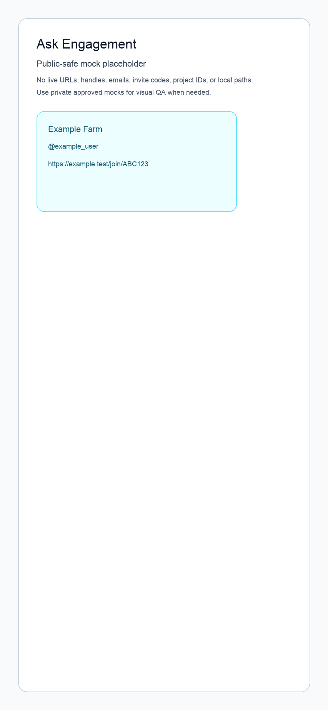

# Home

Status: Draft

Depends on:

- `docs/features/01_X_LOGIN.md` - WIP in a separate worktree/subtree.
- `docs/features/03_FARM.md` - Farm creation, membership, and join links.
- `docs/features/05_POST.md` - WIP request-status/read model.
- `docs/features/06_AUTO_ENGAGE.md` - backend like worker after request creation.

## Purpose

Define Farm's main authenticated Home screen: the place a user lands after app
login, understands whether they are ready to use Farm, pastes an existing X post
URL, chooses a Farm, requests engagement, checks recent request progress, and
navigates to My Farms, Posts/history, request status, and Settings.

This feature matters because Home is the product's working surface. The user
should not feel like they are in onboarding or a dashboard. They should be able
to do one practical thing quickly: paste a public X post URL and ask a trusted
Farm to like it through connected X accounts.

## Current Scope

- Replace the placeholder Home behavior with the full authenticated Home
  experience from `docs/mocks/ask-engagement.png`.
- Treat `01_X_LOGIN` as completed before this work starts.
- Treat `05_POST` as completed before this work starts.
- Show the missing-X CTA state from `01_X_LOGIN` when the user does not have an
  eligible linked X account.
- Show the linked-ready Home request form when the user has an eligible linked X
  account.
- Let the user paste an existing X post URL.
- Let the user select one of their active Farms.
- Default the Farm selector when the user has exactly one Farm.
- Preserve Home prefill from request status `Ask again` navigation when query
  params are present.
- Validate and canonicalize the X post URL server-side before creating an
  engagement request.
- Verify the target post through official X API reads before accepting the
  request.
- Create one engagement request for the selected Farm and target X post.
- Snapshot active Farm members into durable engagement-attempt rows.
- Include the requester in the target snapshot when they are an active member of
  the selected Farm.
- Mark members without eligible linked X accounts as skipped/no-X at creation
  time.
- Queue or schedule the automatic engagement worker owned by
  `docs/features/06_AUTO_ENGAGE.md`.
- Navigate to `/requests/[requestId]` after a request is accepted.
- If the same Farm already has a non-canceled request for the same X post, route
  the user to the existing request instead of creating a duplicate.
- Show recent request summaries on Home and link each row to request status.
- Show the user's Farms on Home and link each row to Farm detail.
- Show persistent top-level bottom navigation for `My Farms`, `Home`, and
  `Posts`, with Home emphasized as the primary center tab.
- Handle empty, loading, validation, duplicate, and failure states in the Home
  surface.
- Update the PRD with the Home/request-creation direction.

## Future Scope

- Creating or composing new X posts inside Farm.
- Comments, reposts, quote posts, bookmarks, follows, DMs, or non-like
  engagement.
- Scheduling requests for later.
- Approval workflows before a request is processed.
- Multi-Farm batch requests.
- Campaigns, request templates, or recurring automations.
- Request cancellation or retry controls from Home.
- Rich analytics charts on Home.
- Notifications for request completion.
- Public request pages for non-members.
- LinkedIn or other social platforms.
- A broad desktop dashboard.
- Manual production deploys.

## Non-Goals

- Do not implement X OAuth linking in this feature. It is owned by
  `docs/features/01_X_LOGIN.md`.
- Do not implement the request status detail page in this feature. It is owned
  by `docs/features/05_POST.md`.
- Do not implement the automatic X like worker in this feature. It is owned by
  `docs/features/06_AUTO_ENGAGE.md`.
- Do not redefine Farm creation, join, leave, delete, membership, or invite
  behavior. It is owned by `docs/features/03_FARM.md`.
- Do not require users to post through Farm. Home accepts existing public X post
  URLs only.
- Do not use browser automation, scraping, unofficial X access, or stored X
  passwords.
- Do not make browser-side calls to X APIs.
- Do not expose raw X OAuth token material, raw X API responses, or sensitive
  error payloads to the browser.
- Do not add new shadcn components unless they already exist in the repo when
  implementation begins.

## Design

### Approved And Reference Mocks

- Primary Home mock: `docs/mocks/ask-engagement.png`
- Missing-X Home mock from X linking: `docs/mocks/01_X_LOGIN/home-missing-x.png`
- Request status destination mock: `docs/mocks/request-status.png`
- Farm flow mock packet: `docs/mocks/03_FARM/farm-flow-main.png` and
  `docs/mocks/03_FARM/farm-flow-confirmations.png`
- Settings account/X entry reference:
  `docs/mocks/01_X_LOGIN/settings-x-unlinked.png` and
  `docs/mocks/01_X_LOGIN/settings-x-linked.png`




The new paste-URL request flow is represented by the existing
`docs/mocks/ask-engagement.png` Home mock. No new image mock was generated in
this spec pass because the current approved mocks already show the URL input,
Farm selector, primary request action, readiness strip, recent request entry,
missing-X blocked state, and request status destination. If product changes the
visual shape beyond these mocks, create and approve a dedicated
`docs/mocks/04_HOME/` mock packet before implementation.

### Visual Thesis

Home should feel like a native mobile command surface: direct single-line
heading, one dominant URL paste action, a Farm selector with quiet account
readiness undertext, a confident green request button, and status/navigation
rows below.

### Content Plan

- Header: brand plus Settings entry.
- Request composer: paste URL, choose Farm, request engagement.
- Farm selector: show the selected Farm name with linked-account readiness as
  subtle undertext.
- Recent request: show the latest active or recent status and link to details.
- My Farms: expose Farm navigation and creation path without turning Home into a
  management screen.
- Bottom navigation: expose My Farms, Home, and Posts without replacing the
  Home header Settings gear.

### Interaction Thesis

- The primary action stays disabled until the user has a linked X account, at
  least one Farm, a selected Farm, and a non-empty post URL.
- Pasting a URL should feel forgiving: trim whitespace, accept common X/Twitter
  post URL shapes, canonicalize on the server, and preserve the field value when
  validation fails.
- Successful submission should move directly to request status so the user can
  watch the request settle.

### Key Layout Decisions

- Keep the same mobile-first app shell used by the mocks: narrow centered
  surface, white/background canvas, green primary accent, large heading, rounded
  input rows, and simple list rows.
- Desktop uses the same constrained app surface rather than a wide dashboard.
- Use shadcn/Tailwind v4 tokens from `app/globals.css` for foundational
  surfaces: `bg-background`, `text-foreground`, `bg-card`, `border-border`,
  `text-muted-foreground`, `bg-primary`, `text-primary-foreground`,
  `text-destructive`, and `ring-ring`.
- Keep font tokens in `@theme inline` as literal Geist stacks.
- Compose only existing shadcn components. Current repo components include
  `Button`, `Card`, `Input`, `Label`, `Badge`, `Avatar`, `Separator`, `Dialog`,
  and `Select`.
- Use lucide icons for settings, link, Farm, account readiness, shield/check,
  request/document, chevrons, alerts, and loading/error affordances.
- Prefer plain sections and rows over nested card stacks. Cards are acceptable
  for the URL field, Farm selector, recent request row, and Farm list rows
  because those are the interaction blocks shown in the mocks.
- When X is missing, the main request CTA becomes `Link X account` with a
  warning icon and routes to Settings, as defined in `01_X_LOGIN`.
- In the linked-ready state, the readiness strip should show real eligible
  linked X accounts, not total Farm member count.
- The request button copy is `Request`.
- The recent request row copy should use live request data, not mock dates.

### Mobile Behavior

- Mobile is the primary target.
- The first viewport should show brand, heading, URL field, Farm selector, and
  request button on common phone heights.
- The recent request and My Farms sections can sit below the fold.
- Inputs and buttons must have comfortable touch targets.
- Long URLs, Farm names, handles, and request titles must truncate or wrap
  without horizontal overflow.

### Desktop Behavior

- Keep the app at the same narrow max width as other authenticated screens.
- Center the surface on `bg-background`.
- Do not add desktop-only sidebars, analytics grids, or extra dashboard chrome.

### Design Approval Status

- Existing Home and request-status mocks are the approved direction.
- Missing-X Home behavior is owned by `01_X_LOGIN`.
- This spec is ready for implementation once the WIP X linking and request
  status contracts have landed, unless product requests a new `04_HOME` mock
  packet.

## Spec-Writing Findings

- Product and docs:
  - `docs/PRD.md` already defines Home's core job under Request Engagement but
    did not yet link to a detailed Home spec.
  - `docs/features/01_X_LOGIN.md` owns missing-X gating and Settings OAuth.
  - `docs/features/05_POST.md` owns request detail, recent request destination,
    member outcome statuses, and the `Ask again` navigation contract.
  - `docs/features/06_AUTO_ENGAGE.md` is still a placeholder, so Home should
    define request creation and scheduling handoff without owning the like
    worker.
- Design, frontend, and shadcn:
  - The existing mocks already cover the linked-ready Home, missing-X Home,
    request status destination, Farm navigation, and Settings account area.
  - `components.json` uses shadcn with existing UI source files under
    `components/ui`.
  - Current shadcn components available in the repo are enough for this spec.
- Technical, data, and verification:
  - Convex guidance requires auth-derived user identity, validators, indexes
    over filters, bounded reads, and no sensitive public functions.
  - X docs confirm the relevant v2 shape: OAuth 2.0 Authorization Code with
    PKCE supports fine-grained scopes; Farm requests `tweet.read users.read
    like.write offline.access` for user linking. X requires the read scopes for
    the numeric X user ID and user-context like endpoint; Farm uses them only to
    identify the linked account and like submitted post URLs.
  - Existing WIP request files in this workspace indicate the expected tables
    are `engagementRequests` and `engagementAttempts`; implementation should
    coordinate with the WIP branch instead of re-creating divergent schema.

## Product Requirements

### User Problem

A Farm member has a post already live on X and wants quick support from a
trusted group. The current manual behavior is pasting links in group chats and
hoping people notice. Home should make that action explicit, validated, and
trackable.

### Product Goal

Let an eligible user create an auditable engagement request in under a minute:
paste a public X post URL, choose a Farm, submit, and land on request status.

### Primary User Journey: Request Likes From Home

- Entry point: authenticated user lands on Home after password login.
- User intent: ask a Farm to like an existing X post.
- Preconditions:
  - The user is signed into Farm.
  - `01_X_LOGIN` has provided an eligible linked X account state.
  - The user belongs to at least one active Farm.
  - `05_POST` request status route is available.
- Steps:
  1. System loads linked X status, active Farm memberships, and recent request
     summaries.
  2. User sees the linked-ready Home surface.
  3. User pastes an X post URL into `Paste X post URL`.
  4. User confirms or changes the selected Farm.
  5. User taps `Request`.
  6. System trims and validates the URL.
  7. System verifies the post through official X APIs.
  8. System checks whether this Farm already has a non-canceled request for the
     same X post.
  9. If no duplicate exists, system creates an engagement request and snapshots
     active Farm members into attempt rows.
  10. System queues the automatic engagement worker.
  11. System navigates to `/requests/[requestId]`.
- System behavior:
  - Auth and ownership are derived server-side from Convex Auth.
  - The selected Farm must be an active Farm where the viewer is an active
    member.
  - The request uses the canonical X post id as the durable provider id.
  - The request creator is included in the target snapshot when eligible.
  - Members without eligible X accounts are represented in attempt rows as
    skipped/no-X.
- Success outcome: user lands on request status and sees progress begin.
- Failure outcome: user remains on Home with a concise recoverable error and
  their pasted URL preserved.
- Next destination: request status detail.

### Primary User Journey: Missing X Setup

- Entry point: authenticated user lands on Home without an eligible linked X
  account.
- User intent: understand why request creation is unavailable.
- Steps:
  1. System loads linked X account state.
  2. Home disables the URL field and Farm selector.
  3. The main request button becomes `Link X account` with a warning icon.
  4. User taps `Link X account`.
  5. System routes to Settings.
- System behavior:
  - Do not create engagement requests while X is missing, expired, revoked, or
    missing required scopes.
  - Do not hide the rest of Home navigation.
- Success outcome: user reaches Settings and can connect/reconnect X.
- Failure outcome: navigation errors are recoverable and Home remains readable.
- Next destination: Settings.

### Secondary User Journey: One Farm Default

- Entry point: authenticated linked-X user has exactly one active Farm.
- User intent: submit without extra selection work.
- Steps:
  1. System loads Farms.
  2. Farm selector defaults to the only Farm.
  3. User can submit after pasting a URL.
- System behavior: the selector remains visible so the user understands which
  Farm will receive the request.
- Success outcome: user does not need to make a redundant selection.
- Failure outcome: if the Farm becomes unavailable before submit, show
  `Choose an available Farm.`
- Next destination: request status.

### Secondary User Journey: Multiple Farms

- Entry point: authenticated linked-X user belongs to multiple active Farms.
- User intent: choose the correct audience.
- Steps:
  1. System loads active Farms.
  2. Home shows the first or most recent Farm as a default only if repo/product
     evidence supports that ordering.
  3. User changes the selected Farm from the selector.
  4. User submits the request.
- System behavior:
  - The backend validates membership for the submitted Farm.
  - The request targets only the selected Farm.
- Success outcome: exactly one Farm receives the request.
- Failure outcome: if no Farm is selected, show `Choose a Farm first.`
- Next destination: request status.

### Secondary User Journey: No Farms Yet

- Entry point: authenticated linked-X user has no active Farms.
- User intent: understand the next useful action.
- Steps:
  1. System loads Farms and receives an empty list.
  2. Home keeps the request composer visible but disables request submission.
  3. Farm selector shows an empty or `Choose a Farm` state.
  4. Home shows a `No Farms yet` state and `Create Farm` action.
  5. User can navigate to Farm creation.
- System behavior: no request can be created without a selected active Farm.
- Success outcome: user reaches Farm creation.
- Failure outcome: Farm load errors are shown inline with retry/navigation.
- Next destination: `/farms/new` or `/farms`.

### Secondary User Journey: Duplicate Request

- Entry point: user submits an X post URL for a Farm that already has a
  non-canceled request for the same provider post id.
- User intent: request engagement.
- Steps:
  1. System canonicalizes the submitted X post URL.
  2. System finds an existing request by `farmId`, `provider`, and
     `providerPostId`.
  3. System returns the existing request id instead of inserting a duplicate.
  4. Home navigates to that request status detail.
- System behavior:
  - Duplicate detection should be server-side.
  - The UI may show a small notice such as `Opening the existing request.`
  - A request with status `canceled` can be excluded from duplicate blocking if
    cancellation is later implemented.
- Success outcome: user lands on the existing request and avoids duplicate
  attempt rows.
- Failure outcome: if the existing request is unavailable to the viewer, show a
  generic request creation error and do not reveal private data.
- Next destination: request status.

### Secondary User Journey: Ask Again Prefill

- Entry point: user taps `Ask again` on request status.
- User intent: start another request path using the same post/Farm context.
- Steps:
  1. Request status navigates to Home with `postUrl` and `farmId` query params.
  2. Home validates that the viewer can still access the Farm.
  3. Home pre-fills the URL field.
  4. Home pre-selects the Farm if still active and accessible.
  5. User can edit either field before submitting.
- System behavior:
  - Prefill is UI state only.
  - Home must not create a request just because query params exist.
  - Duplicate policy still applies on submit.
- Success outcome: user reaches Home with useful context preserved.
- Failure outcome: if the Farm is not accessible, keep the post URL and ask the
  user to choose a Farm.
- Next destination: Home until submit, then request status.

### Secondary User Journey: View Recent Requests

- Entry point: authenticated user lands on Home.
- User intent: check recent progress.
- Steps:
  1. System loads bounded recent requests visible to the user.
  2. Home shows `Recent request` or `Recent requests` when at least one exists.
  3. Each row shows request title/fallback, Farm name or date, aggregate like
     count, status badge, and chevron.
  4. User taps a row.
  5. System routes to `/requests/[requestId]`.
- System behavior:
  - Only show requests for Farms where the user is an active member.
  - Keep the list bounded for Home. Use a dedicated history surface later if
    needed.
- Success outcome: user can jump back into request status.
- Failure outcome: if recent requests fail to load, show a small inline state
  or omit the section while keeping request creation usable.
- Next destination: request status.

### Edge Cases

- User pastes whitespace or an empty value.
- User pastes a non-URL string.
- User pastes a URL that is not `x.com` or `twitter.com`.
- User pastes a profile URL, search URL, quote URL without a status id, or an
  unsupported X URL.
- User pastes `mobile.twitter.com`, `www.x.com`, `twitter.com`, or URLs with
  query params.
- URL contains an X status id larger than JavaScript's safe integer range.
- X post is deleted, private, restricted, suspended, withheld, or unavailable.
- X API lookup fails because of rate limits, credits, outage, auth failure, or
  missing scopes.
- User's X token is revoked between page load and submit.
- User disconnects X in another tab.
- User has no Farms.
- User leaves the selected Farm in another tab.
- Farm is deleted before submit.
- Same post was already requested in the same Farm.
- Same post is requested in a different Farm.
- Target Farm has zero active members.
- Target Farm has members but no eligible linked X accounts.
- Request creator is the only member.
- User double-clicks or double-taps submit.
- Browser refreshes during submission.
- Query-param prefill includes an invalid or inaccessible Farm id.
- Long URLs, long Farm names, and long request titles must not overflow.

## UX Requirements

### Screen/Page Inventory

- Home linked-ready state.
- Home missing-X blocked state.
- Home loading linked account/Farm/request summaries.
- Home no-Farms state.
- Home request validation error state.
- Home X lookup failure state.
- Home duplicate request redirect state.
- Home request submission loading state.
- Home recent requests section.
- Home My Farms section.

### Required UI States

- Signed-in loading shell while auth/Convex data resolves.
- X linked and eligible.
- X missing.
- X expired/revoked/needs reconnect.
- Farms loading.
- No Farms.
- One Farm selected by default.
- Multiple Farms selectable.
- Request form empty.
- Request form prefilled from `Ask again`.
- URL validation error.
- X post verification loading.
- X post unavailable.
- Duplicate existing request found.
- Request creation pending.
- Request creation accepted.
- Request creation failed.
- Recent requests loading/empty/populated.
- My Farms loading/empty/populated.

### Copy Requirements

- Brand: `Farm`
- Page heading: `Request X Engagement`
- Supporting copy: none.
- URL placeholder: `Paste X post URL`
- URL label: `X post URL`
- Farm selector label: `Farm`
- Primary action: `Request`
- Missing-X primary action: `Link X account`
- Loading action: `Creating request...`
- Farm selector undertext: `{eligibleAccountCount} linked accounts ready`
- Do not show a separate readiness strip or `Official X API only` badge.
- Do not show a separate missing-X setup card, `Setup` badge, missing-X body
  copy, or secondary setup action.
- No-Farms title: `No Farms yet`
- No-Farms body: `Create your first Farm and share one join link.`
- No-Farms action: `Create Farm`
- Recent section heading: `Recent request` when showing one row, or
  `Recent requests` when showing multiple rows.
- My Farms heading: `My Farms`
- View-all Farms action: `View all`
- Empty URL error: `Paste an X post URL.`
- Missing Farm error: `Choose a Farm first.`
- Invalid URL error: `Enter a valid X post URL.`
- Non-X URL error: `Enter an x.com post URL.`
- Missing status id error: `Enter an X post URL with a status id.`
- X unavailable error: `Could not verify this X post.`
- Farm unavailable error: `Choose an available Farm.`
- Missing linked X error: `Connect your X account before requesting likes.`
- Generic create failure: `Could not create the request.`
- Duplicate notice, if shown: `Opening the existing request.`

### Fields And Validation

- `postUrl`
  - Required on submit.
  - Trim leading/trailing whitespace.
  - Accept `https://x.com/{username}/status/{id}`.
  - Accept `https://twitter.com/{username}/status/{id}`.
  - Accept common `www.` and `mobile.` host variants if implementation can
    canonicalize them cleanly.
  - Ignore query params and fragments for canonical identity.
  - Extract and store the numeric post id as a string.
  - Canonicalize to `https://x.com/{username}/status/{id}` when username is
    available, otherwise `https://x.com/i/status/{id}`.
  - Do not coerce the id into a JavaScript number.
- `farmId`
  - Required on submit.
  - Must be an active Farm where the viewer is an active member.
  - Use a Convex id validator in backend functions.
  - Query-param prefill must still be validated server-side before mutation.
- Linked X account state
  - Must be eligible before request creation.
  - Eligible means connected, provider `x`, usable token material exists
    server-side, required scopes are present, and account is not marked revoked
    or expired without refresh.
- X post verification
  - Use official X API server-side.
  - Fetch only fields needed for display and processing.
  - Store safe cached metadata such as author username, display name, text
    preview, created timestamp, and public metrics if available and useful.
  - Do not block forever on metadata that is optional, but do not create a
    request if the post cannot be verified as an accessible X post.

### Loading States

- Keep the Home shell stable while loading.
- Disable the submit button while creating a request.
- Use stable button dimensions while loading.
- Show concise inline text for URL verification/submission.
- Prevent duplicate submissions.
- Do not use a full-screen spinner after the first authenticated shell is
  mounted unless no meaningful app content can be shown.

### Empty States

- No Farms:
  - Keep the Home heading and request form visible.
  - Disable request submission.
  - Show `No Farms yet` with `Create Farm`.
- No recent requests:
  - Omit the recent request section or show a compact empty state only if there
    is enough space.
  - Do not make recent history compete with the primary request flow.
- Selected Farm has no other eligible linked accounts:
  - Allow creation when the requester has eligible linked X, even if no other
    members are currently eligible.
  - Show the readiness count honestly with singular/plural copy.
  - The resulting request status should show no-X/skipped outcomes for
    ineligible members.

### Error States

- Place form errors near the form.
- Preserve user-entered URL after errors.
- Use user-actionable copy and avoid raw backend/X error strings.
- Missing X should route to Settings.
- Missing Farm should route to Farm creation/management.
- X post unavailable should keep the user on Home.
- Duplicate request should navigate to the existing request if authorized.
- Authentication loss should return to login and preserve the intended URL when
  possible.

### Success States

- Successful request creation navigates directly to `/requests/[requestId]`.
- If an existing duplicate request is reused, navigation still goes to
  `/requests/[requestId]`.
- No celebratory interstitial.
- Request status owns the completion/progress UI after navigation.

### Accessibility Basics

- Inputs need programmatic labels.
- The Farm selector needs an accessible name and readable selected value.
- Disabled controls need nearby explanatory text.
- Form errors should use `role="alert"` or be associated with the invalid field.
- Icon-only buttons need accessible labels.
- Status badges must include text, not color alone.
- Tap targets should be comfortable on mobile.
- Keyboard order should match the visual order.
- Loading state should be perceivable without relying only on button disabled
  styling.

### Responsive Behavior

- Mobile first.
- Desktop remains narrow and centered.
- No horizontal scrolling.
- Long text truncates or wraps intentionally.
- The request button should not be covered by browser/PWA safe-area chrome.
- If the app is installed as a PWA, the same Home flow should remain usable.

## Technical Specification

### Required Skills And Plugins

Implementation agents must re-open the relevant skills before code changes:

- `$frontend-skill` for app-surface visual quality, mobile-first hierarchy, and
  interaction polish.
- `$vercel-plugin/shadcn` for shadcn composition and component constraints.
- `$X` for X OAuth, official API endpoints, scopes, rate limits, pagination, and
  token behavior.
- `$convex` plus `docs/CONVEX.md` and
  `convex/_generated/ai/guidelines.md` before backend changes.
- `@browser` / `$browser-use` for local app verification.

Use `pnpm` for package commands. Do not manually deploy; production deploys are
automatic after GitHub push.

### Frontend

- Routes/pages affected:
  - `/` Home route.
  - `/settings` only as the missing-X destination.
  - `/farms`, `/farms/new`, and `/farms/[farmId]` only as navigation targets.
  - `/requests/[requestId]` only as the post-submit destination.
- Component ownership:
  - Home can stay inside `components/farm-app.tsx` if small enough.
  - Extract `HomeScreen`, `RequestComposer`, `ReadinessStrip`,
    `RecentRequests`, `MyFarmsHomeList`, and `MissingXHomeGate` when needed to
    keep files readable.
  - Do not refactor unrelated Farm, Settings, auth, or request-status code just
    to implement Home.
- Existing shadcn components to compose:
  - `Button`
  - `Card`
  - `Input`
  - `Label`
  - `Badge`
  - `Avatar` where Farm or request rows need initials/avatar treatment.
  - `Separator`
  - Native `form`, `select`, `section`, `header`, `a`, `button`, and list
    semantics styled with tokens.
- Theme/token changes:
  - Avoid ad-hoc hex values and Tailwind palette colors for core surfaces.
  - Use primary token for the green request action.
  - Use muted/card/border tokens for inputs and list rows.
  - Use destructive token for validation or critical errors.
  - Avoid one-off blue except where an external X link treatment already exists
    in the request-status implementation.
- State management:
  - Convex queries own linked X eligibility, active Farms, recent request
    summaries, and request creation.
  - Local component state owns input text, selected Farm id, submission pending
    state, and transient client-side errors.
  - Query params from `Ask again` seed local state only after access checks.
- Form handling:
  - Client trims and checks obvious empty/non-empty states.
  - Server owns authoritative URL parsing, X verification, Farm membership
    authorization, duplicate detection, request creation, and worker handoff.
  - Prevent duplicate submits.
  - Preserve form values on failure.
- Navigation:
  - Settings gear routes to `/settings`.
  - Missing-X prompt routes to Settings.
  - Create Farm routes to `/farms/new`.
  - Farm rows route to `/farms/[farmId]`.
  - Recent request rows route to `/requests/[requestId]`.
  - Successful request creation uses Next navigation to request status.
  - `Ask again` query params should be `postUrl` and `farmId` unless the
    request-status implementation has already landed a different contract.
- Loading/error/success handling:
  - Use inline states.
  - Keep the layout stable.
  - Never render raw token, internal action, stack trace, or raw X error data.

### Convex / Backend

Read `docs/CONVEX.md` and `convex/_generated/ai/guidelines.md` before editing
backend code. This section defines the target Home/request-creation contract and
must be reconciled with the WIP `01_X_LOGIN` and `05_POST` worktrees before
implementation.

Home owns public request creation. `05_POST` owns request detail/list reads.
`06_AUTO_ENGAGE` owns the worker that calls X like endpoints and updates
attempt rows.

Required existing or incoming entities:

- `accounts` from `01_X_LOGIN`.
- `farms`, `farmMemberships`, and `farmInviteLinks` from `03_FARM`.
- `engagementRequests` and `engagementAttempts` from `05_POST`.
- Optional `externalPosts` if implementation normalizes X post metadata.

Required `accounts` fields consumed by Home:

- `userId` or equivalent owner id derived from Convex Auth.
- `profileId` if product queries use profiles.
- `provider`: `"x"`.
- `providerAccountId`: stable X user id.
- `username`: X handle without `@`.
- `displayName`: optional X display name.
- `status`: at least active, expired, revoked, disconnected, or needs reconnect.
- `scopes`: stored or derivable granted scopes.
- Token material reference or encrypted token fields, server-only.
- `connectedAt`, `updatedAt`, and optional `disconnectedAt`.

Recommended `engagementRequests` fields for Home creation:

- `farmId`: `v.id("farms")`.
- `requesterUserId`: `v.id("users")`.
- `requesterProfileId`: `v.id("profiles")`.
- `provider`: `"x"`.
- `providerPostId`: string numeric X post id.
- `postUrl`: canonical X URL.
- `postTitle`: safe cached title/text fallback.
- `postTextPreview`: optional text preview if separate from title.
- `postAuthorUsername`: optional X handle without `@`.
- `postAuthorDisplayName`: optional display name.
- `postCreatedAt`: optional timestamp.
- `postPublicMetrics`: optional bounded object if useful and allowed.
- `action`: `"like"`.
- `status`: `"active" | "completed" | "partial" | "failed" | "canceled"`.
- `targetMemberCount`, `likedCount`, `pendingCount`, `skippedCount`,
  `failedCount`.
- `duplicateOfRequestId`: optional only if product later wants to record
  duplicate attempts rather than route to the existing request.
- `createdAt`, `updatedAt`, `completedAt`, `canceledAt`.

Recommended `engagementAttempts` fields for Home creation:

- `requestId`: `v.id("engagementRequests")`.
- `farmId`: `v.id("farms")`.
- `membershipId`: `v.id("farmMemberships")`.
- `userId`: `v.id("users")`.
- `profileId`: `v.id("profiles")`.
- `accountId`: optional `v.id("accounts")`.
- `provider`: `"x"`.
- `providerAccountId`: optional X user id.
- `providerUsername`: optional X handle.
- `status`:
  - `"pending"`
  - `"liked"`
  - `"already_liked"`
  - `"skipped_no_x"`
  - `"skipped_ineligible"`
  - `"failed_retryable"`
  - `"failed_final"`
- `attemptCount`: number.
- `lastErrorCode`, `lastErrorMessage`, `lastTriedAt`, `nextRetryAt`.
- `createdAt`, `updatedAt`, `completedAt`.

Recommended indexes:

- `accounts.by_userId_and_provider_and_status`
- `accounts.by_provider_and_providerAccountId`
- `farmMemberships.by_userId_and_status`
- `farmMemberships.by_farmId_and_status`
- `farmMemberships.by_farmId_and_userId`
- `engagementRequests.by_farmId_and_createdAt`
- `engagementRequests.by_farmId_and_status_and_createdAt`
- `engagementRequests.by_requesterUserId_and_createdAt`
- `engagementRequests.by_farmId_and_provider_and_providerPostId`
- `engagementRequests.by_provider_and_providerPostId`
- `engagementAttempts.by_requestId_and_status`
- `engagementAttempts.by_requestId_and_membershipId`
- `engagementAttempts.by_farmId_and_userId`
- `engagementAttempts.by_accountId_and_status`
- `externalPosts.by_provider_and_providerPostId`, if used.

Required public queries:

- `home.get` or equivalent composed client queries:
  - Returns linked X eligibility summary.
  - Returns active Farms the viewer belongs to.
  - Returns bounded recent request summaries visible to the viewer.
  - Returns eligible linked account count across the selected or accessible Farm
    context when available.
- `accounts.getLinkedXStatus` or equivalent from `01_X_LOGIN`:
  - Returns active/missing/reconnect state without token material.
- `requests.listMine` or equivalent from `05_POST`:
  - Returns bounded recent request summaries for Home.

Required public mutation/action:

- `requests.createFromHome({ farmId, postUrl })`
  - Authenticates the viewer.
  - Requires eligible linked X for the requester.
  - Validates active membership in the selected Farm.
  - Parses and canonicalizes the X post URL.
  - Verifies the X post through official X API server-side.
  - Fetches safe metadata for display when available.
  - Checks duplicate policy for the selected Farm and post id.
  - Creates `engagementRequests`.
  - Creates one `engagementAttempts` row per active Farm member.
  - Sets no-X/ineligible members to skipped states.
  - Sets eligible members to pending.
  - Maintains denormalized counts.
  - Schedules or enqueues `06_AUTO_ENGAGE`.
  - Returns `{ requestId, reusedExisting: boolean }`.

Runtime boundary options:

- Preferred: a Convex public action handles URL verification with X, then calls
  an internal mutation to create the request and attempt rows transactionally.
- Acceptable: a Next.js route handler performs X lookup, then calls Convex
  mutations, if the WIP X OAuth implementation has already chosen Next.js as
  the token-exchange/X runtime.
- Do not split token lookup, X verification, and request creation across both
  runtimes without a clear reason. Pick one owner so secrets, errors, and
  retries stay understandable.

Required internal helpers:

- Parse/canonicalize X post URLs.
- Resolve current viewer/profile from auth.
- Require active Farm membership.
- Load eligible linked X account for requester.
- Load active Farm members.
- Load each member's eligible X account, if any.
- Detect duplicate request for `farmId + provider + providerPostId`.
- Create request and attempt snapshot.
- Schedule/enqueue auto-engage worker.

Backend requirements:

- Use validators for every function argument.
- Derive user identity from auth; never accept user ids from the client for
  authorization.
- Use indexes, not filters.
- Keep reads bounded or paginated.
- Do not store unbounded arrays of members on `engagementRequests`.
- Maintain denormalized counts during mutations.
- Store provider post ids as strings.
- Store safe user-facing error categories separately from raw provider errors.
- Never return raw OAuth tokens or raw X API payloads to the browser.

### Auth

- Farm app login is owned by `docs/features/00_LOGIN.md`.
- X account linking is owned by `docs/features/01_X_LOGIN.md`.
- Home consumes linked X state and gates request creation.
- A user must be signed into Farm before viewing Home.
- A user must have an eligible linked X account before creating a request.
- The selected Farm must be an active Farm where the viewer is an active member.
- Request visibility after creation is owned by `05_POST` and gated by Farm
  membership.
- Signed-out users who open a request link or join link should return to their
  intended destination after login, per the relevant feature specs.

### X Integration

- Integration purpose:
  - Verify that a pasted URL points to an accessible X post.
  - Cache safe post metadata for Home/request status.
  - Queue likes through user-context X access owned by `06_AUTO_ENGAGE`.
- Official docs checked for this spec:
  - X OAuth 2.0 Authorization Code with PKCE:
    `https://docs.x.com/fundamentals/authentication/oauth-2-0/authorization-code`
  - X v2 authentication mapping:
    `https://docs.x.com/fundamentals/authentication/guides/v2-authentication-mapping`
  - X Likes endpoints:
    `https://docs.x.com/x-api/posts/likes/introduction`
- Expected scopes from `01_X_LOGIN`:
  - `like.write`
  - `offline.access`
- Expected post lookup:
  - `GET /2/tweets/:id`
  - Use fields/expansions only for display and processing needs.
- Expected like action, owned by `06_AUTO_ENGAGE`:
  - `POST /2/users/:id/likes`
  - Body includes the target `tweet_id`.
  - The path user id must correspond to the authenticated user/account whose
    token is used.
- Failure handling:
  - Treat X 401/403 as token/scope/reconnect or permission problems.
  - Treat 404 or unavailable resources as invalid/unavailable post.
  - Treat 429/rate limit and transient 5xx as retryable where appropriate.
  - Surface concise copy on Home and keep detailed provider codes server-side.

### Data Model

#### `accounts`

- Purpose: linked external accounts available for Farm actions.
- Owner: `01_X_LOGIN`.
- Home usage:
  - Determine whether requester can create requests.
  - Count eligible linked accounts for readiness copy.
  - Snapshot member eligibility into attempts.
- Lifecycle:
  - Created/updated by X OAuth linking.
  - Marked expired/revoked/disconnected by token refresh, disconnect, or API
    failures.
  - Never exposed with token material.

#### `engagementRequests`

- Purpose: durable parent record for one Farm request to like one X post.
- Owner: creation by `04_HOME`, detail/read model by `05_POST`, processing by
  `06_AUTO_ENGAGE`.
- Relationships:
  - Belongs to one Farm.
  - Created by one authenticated Farm user/profile.
  - Has many engagement attempts.
  - References one X post by provider post id.
- Creation lifecycle:
  - Created after Home URL/Farm/X validation passes.
  - Starts as `active` unless there are zero targets, in which case it can
    complete immediately with honest counts.
  - Duplicate submissions return the existing request id instead of inserting a
    new row.
- Update lifecycle:
  - Attempt updates from Auto Engage patch aggregate counts.
  - Request status moves to completed, partial, failed, or canceled as attempts
    settle.

Example:

```json
{
  "farmId": "farms:...",
  "requesterUserId": "users:...",
  "requesterProfileId": "profiles:...",
  "provider": "x",
  "providerPostId": "1234567890",
  "postUrl": "https://x.com/yourhandle/status/1234567890",
  "postTitle": "Launch update is live",
  "postAuthorUsername": "yourhandle",
  "action": "like",
  "status": "active",
  "targetMemberCount": 12,
  "likedCount": 0,
  "pendingCount": 9,
  "skippedCount": 3,
  "failedCount": 0,
  "createdAt": 1760000000000,
  "updatedAt": 1760000000000
}
```

#### `engagementAttempts`

- Purpose: durable per-member/account outcome row for one request.
- Owner: created by `04_HOME`, updated by `06_AUTO_ENGAGE`, read by `05_POST`.
- Relationships:
  - Belongs to one engagement request.
  - Belongs to one Farm.
  - References the target membership/user/profile.
  - Optionally references the linked X account used.
- Creation lifecycle:
  - Created from active Farm membership snapshot at request creation time.
  - Eligible linked accounts start `pending`.
  - Missing X accounts start `skipped_no_x`.
- Update lifecycle:
  - Worker updates pending rows to success, already-liked, skipped, retryable
    failure, or final failure.

Example:

```json
{
  "requestId": "engagementRequests:...",
  "farmId": "farms:...",
  "membershipId": "farmMemberships:...",
  "userId": "users:...",
  "profileId": "profiles:...",
  "accountId": "accounts:...",
  "provider": "x",
  "providerAccountId": "<x-user-id>",
  "providerUsername": "<x-handle>",
  "status": "pending",
  "attemptCount": 0,
  "createdAt": 1760000000000,
  "updatedAt": 1760000000000
}
```

#### `externalPosts` Optional

- Purpose: reusable safe cache for X post metadata.
- Use only if multiple requests may reference the same X post across Farms or
  implementation wants to avoid repeating metadata fetches.
- Do not store raw API payloads if they contain unused/sensitive fields.

## Development Plan

1. Re-read `01_X_LOGIN`, `03_FARM`, `05_POST`, `06_AUTO_ENGAGE`,
   `docs/CONVEX.md`, and `convex/_generated/ai/guidelines.md` after the WIP
   branches land.
2. Confirm whether the WIP branches already define `accounts`,
   `engagementRequests`, `engagementAttempts`, request-status routes, and the
   `Ask again` query-param contract.
3. Confirm that the existing Home mocks remain approved. Generate a
   `docs/mocks/04_HOME/` packet only if the visual shape has changed.
4. Add or reconcile Home's linked-X eligibility query contract.
5. Add or reconcile the Home request-creation function/action.
6. Add official X post validation and metadata fetch in the chosen server
   runtime.
7. Add duplicate detection for selected Farm plus provider post id.
8. Create request and attempt snapshot with denormalized counts.
9. Run the narrow official-X like pass owned by `06_AUTO_ENGAGE` after request
   creation.
10. Build the Home UI states against the approved mocks.
11. Wire recent requests and My Farms navigation.
12. Wire `Ask again` prefill.
13. Verify visually and functionally in the in-app browser.
14. Run lint, typecheck, build, and Convex checks.
15. Clean up run-specific artifacts.

### Parallel Implementation Plan

When implementation begins, use four parallel building subagents with
non-overlapping ownership. All subagents must remember they are not alone in the
codebase, must not revert others' edits, must adapt to nearby changes, and must
report changed files plus verification results.

1. Design/theme/mock fidelity owner:
   - Owns Home layout, responsive behavior, token usage, and visual comparison
     to `docs/mocks/ask-engagement.png` and
     `docs/mocks/01_X_LOGIN/home-missing-x.png`.
2. Frontend route and component owner:
   - Owns Home state, request form, Farm selector, recent requests, My Farms,
     navigation, loading/error states, and `Ask again` prefill.
3. Convex/X/data owner:
   - Owns request-creation backend, URL parsing, X verification, duplicate
     detection, request/attempt snapshot, account eligibility, and worker
     handoff.
4. Verification and cleanup owner:
   - Owns browser flow testing, Convex checks, command verification, console/log
     review, artifact cleanup, and spec-adherence review.

The main agent owns final integration across the four ownership areas.

## Acceptance Criteria

- [ ] Home uses the approved linked-ready mock direction from
      `docs/mocks/ask-engagement.png`.
- [ ] Home uses the missing-X state defined by `docs/features/01_X_LOGIN.md`.
- [ ] Home remains a narrow mobile-first app surface on desktop.
- [ ] Home uses only existing shadcn components.
- [ ] Home uses Tailwind v4/shadcn theme tokens for foundational surfaces.
- [ ] Home does not add ad-hoc hex colors for core UI.
- [ ] Signed-in users land on Home after app login.
- [ ] Missing-X users can navigate to Settings and cannot create requests.
- [ ] Linked-X users can paste an X post URL.
- [ ] Users can select one active Farm.
- [ ] Users with exactly one active Farm get it selected by default.
- [ ] Users with no Farms see a clear `Create Farm` path and cannot submit.
- [ ] Server-side validation rejects invalid, non-X, and no-status-id URLs.
- [ ] Server-side validation stores X post ids as strings.
- [ ] Server-side validation canonicalizes accepted X URLs.
- [ ] Farm membership authorization is derived server-side.
- [ ] Request creation requires an eligible linked X account.
- [ ] Request creation verifies the target X post through official X APIs.
- [ ] Request creation does not make browser-side X API calls.
- [ ] Duplicate request submissions for the same Farm/post route to the existing
      request instead of creating duplicate attempts.
- [ ] Request creation snapshots active Farm members.
- [ ] Request creator is included when they are an active member of the selected
      Farm.
- [ ] Members without eligible X accounts appear as skipped/no-X attempt rows.
- [ ] Eligible members appear as pending attempt rows before the like pass
      settles them.
- [ ] Denormalized request counts match the attempt snapshot.
- [ ] Eligible pending attempts are handed to the official-X like pass.
- [ ] Successful submission navigates to `/requests/[requestId]`.
- [ ] `Ask again` pre-fills Home without creating a request.
- [ ] Recent request rows link to request status and show live aggregate counts.
- [ ] My Farms rows link to Farm detail.
- [ ] Form errors preserve user input.
- [ ] Loading states prevent duplicate submits and keep layout stable.
- [ ] No raw OAuth token material or raw X API payloads appear in the browser.
- [ ] Mobile tap targets and keyboard accessibility are acceptable.
- [ ] No unrelated Farm, Settings, X linking, request-status, or auto-engage
      behavior is changed.

## Verification Plan

### Commands

Run the normal repo checks after implementation:

```bash
pnpm lint
pnpm typecheck
pnpm build
pnpm exec convex run health:ping
```

If backend functions changed, also run targeted Convex checks with the CLI. Use
`pnpm exec convex --help` when stuck instead of guessing.

### Visual Testing

Use the in-app Browser plugin on localhost. Compare against:

- `docs/mocks/ask-engagement.png`
- `docs/mocks/01_X_LOGIN/home-missing-x.png`
- `docs/mocks/request-status.png` for post-submit destination

Check:

- mobile viewport
- desktop viewport
- linked-ready Home
- missing-X Home
- no-Farms Home
- loading states
- validation errors
- recent request rows
- My Farms rows
- text overflow
- console errors/warnings

### Flow Testing

Use the in-app Browser plugin to test:

1. Login lands on Home.
2. Missing X changes the main CTA to `Link X account` and routes to Settings.
3. Linked X plus no Farms disables request creation and routes to Farm creation.
4. Linked X plus one Farm defaults the selector.
5. Invalid URL shows inline error.
6. Non-X URL shows inline error.
7. Valid X URL creates or reuses a request.
8. Successful submit navigates to request status.
9. Duplicate valid X URL opens the existing request.
10. `Ask again` returns to Home with prefilled URL/Farm and no automatic
    mutation.
11. Recent request row opens request status.
12. Farm row opens Farm detail.

### Backend/Data Testing

Use Convex CLI checks and targeted queries/mutations to verify:

- account eligibility state is read without token exposure.
- invalid URL mutations are rejected.
- non-member Farm submissions are rejected.
- duplicate detection works for the same Farm/post.
- same post can be requested in a different Farm.
- request row contains canonical URL and provider post id string.
- attempt rows are created for active members only.
- no-X members are skipped.
- eligible members are pending.
- aggregate counts match attempt rows.
- auto-engage handoff is scheduled or queued exactly once per new request.

### X Integration Testing

Use test-safe X credentials and official API paths:

- Verify `GET /2/tweets/:id` succeeds for a known public post.
- Verify unavailable/private/deleted post handling.
- Verify token/scope failures map to safe app errors.
- Do not perform live like actions from Home tests unless explicitly testing
  `06_AUTO_ENGAGE` with approved test accounts.

### Spec-Adherence Testing

After implementation, run a dedicated review comparing code to this spec:

- current scope implemented
- non-goals not implemented
- mocks followed
- dependencies respected
- all acceptance criteria checked
- verification commands and browser flows actually run
- deviations documented with product/technical reason

### Production Verification

Only when pushed or explicitly requested:

- Trust automatic production deployment after GitHub push.
- Check `$NEXT_PUBLIC_APP_URL`.
- Verify production Convex deployment with:

```bash
pnpm exec convex run --deployment $CONVEX_DEPLOYMENT health:ping
```

- Use Vercel CLI to inspect deployment status only if explicitly asked or if
  production behavior appears broken.

## Push / Completion Criteria

When implementation is requested, the work is not complete until:

- Home spec and PRD are up to date.
- Implementation matches approved mocks closely.
- Local browser verification passes.
- Backend/request-creation verification passes.
- X verification is run against safe official API reads.
- Lint, typecheck, build, and Convex health checks pass or blockers are
  documented.
- Run-specific leftovers are removed.
- Changes are committed and pushed if the user asks for push.

## Open Questions

None blocking for Home implementation.

## Assumptions

- `01_X_LOGIN` will land an account model and linked X eligibility query before
  Home implementation starts.
- `05_POST` will land request-status route/read contracts before Home
  implementation starts.
- Home request creation should include the requester when they are an active
  Farm member.
- Home should route to an existing non-canceled same-Farm/same-post request
  instead of creating duplicate attempts.
- URL paste is the only v1 request creation mode.
- X post validation happens server-side through official X APIs.
- The existing mocks remain approved unless product explicitly asks for a new
  mock packet.

## Amendments

### 2026-05-07: URL Paste Request Flow

Expanded Home from placeholder to the full request-creation spec. The current
direction is: after X linking and request status land, Home becomes the main
surface for pasting an existing X post URL, selecting a Farm, validating the
post through official X APIs, creating a request/attempt snapshot, handing off
to Auto Engage, and navigating to request status.
