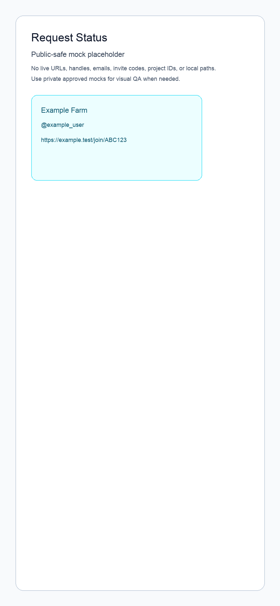

# Request Status

Status: Draft

## Purpose

Define the engagement request detail experience: a user opens a request for an
X post, sees what Farm attempted, understands which members liked, which are
pending, which were skipped or failed, and can return to Home or Farm context.

This feature matters because automatic engagement is only trustworthy if users
can inspect the outcome. A request should not feel like a black box. Users need
clear status, durable history, and a simple answer to "what happened after I
asked my Farm to like this post?"

## Current Scope

- Authenticated Farm members can open a request detail page for a request in a
  Farm they currently belong to.
- Home accepts an X post URL and Farm selection, creates a request, snapshots
  active Farm members as target attempts, and routes to the request detail page.
- The request detail page shows the X post URL, cached X post metadata when
  available, Farm context, requester context, and request timing.
- The page shows high-level progress: likes received through Farm, total target
  members, pending count, skipped count, failed count, and aggregate request
  status.
- The page shows one outcome row per targeted Farm member for v1.
- Outcome rows support these user-facing states:
  - `Liked`
  - `Already liked`
  - `Pending`
  - `No X linked`
  - `Skipped`
  - `Failed`
- The page supports historical requests after processing finishes.
- The page has a copyable status link.
- The page has an `Ask again` action that navigates back to Home with the same
  post/Farm context when that Home prefill contract exists. It must not create a
  duplicate request by itself.
- Home shows recent request rows that link back to request detail.
- The feature defines the read model and backend status contract needed by Home
  and Auto Engage, without taking over their implementation scope.
- Existing mocks remain the visual source of truth for layout, density,
  typography, icons, and control treatment.

## Future Scope

- Advanced Home request creation controls such as rich Farm filtering,
  duplicate-request policy, and full request history.
- Live X metadata validation before request creation.
- Running X API like actions.
- Retrying failed attempts automatically or manually.
- Detailed member/account drill-down screens.
- Admin-only request controls or moderation actions.
- Editing or canceling an in-flight request.
- Public share pages for non-members.
- Live X post metric refresh beyond Farm-recorded attempt status.
- Comments, reposts, bookmarks, follows, LinkedIn, or any non-like engagement.
- Broad analytics dashboards, charts, or campaign reporting.
- Notifications when a request completes or needs attention.

## Non-Goals

- Do not implement advanced Home request creation beyond the narrow X URL, Farm
  selection, create request, and route-to-status flow.
- Do not implement X OAuth account linking in this feature. That belongs to
  `docs/features/01_X_LOGIN.md`.
- Do not implement the automatic like worker in this feature. That belongs to
  `docs/features/06_AUTO_ENGAGE.md`.
- Do not redefine Farm creation, join, leave, delete, membership, or invite
  behavior. That belongs to `docs/features/03_FARM.md`.
- Do not expose raw X OAuth tokens, raw API responses, or sensitive error
  payloads to the browser.
- Do not show non-members private request details.
- Do not build a wide desktop dashboard.
- Do not add new shadcn components unless they already exist in the repo when
  implementation begins.
- Do not manually deploy; production deploys are automatic on GitHub push.

## Design

### Existing Reference Mocks

- Primary request status reference: `docs/mocks/request-status.png`
- Home reference for recent request entry: `docs/mocks/ask-engagement.png`
- Farm/member row density reference:
  `docs/mocks/03_FARM/farm-flow-main.png`



The request status mock shows this screen packet:

1. `request-status`
   - Top nav: back button, centered title `Request status`, optional trailing
     menu icon.
   - X post section with label, cached post title or fallback, and external X
     link.
   - Large progress headline such as `9 of 12 likes`.
   - Horizontal progress bar.
   - Compact status pills for aggregate state and pending count.
   - Member outcome list with avatar or initials, member name, X handle or
     missing-X copy, outcome pill, and row affordance.
   - Bottom actions: `Copy link` and `Ask again`.

The Home mock includes a `Recent request` entry that can link to the request
detail route once Home owns request creation/listing.

### Visual Thesis

Request status should feel like a native mobile receipt: quiet white canvas,
large confident progress, simple member rows, green success states, and no
dashboard chrome.

### Content Plan

- Header: orient the user inside a single request.
- Post block: identify the X post and give an external escape hatch.
- Progress block: answer the main question in one glance.
- Member outcomes: show exactly who is done, pending, skipped, or failed.
- Bottom actions: copy the status link or start a new request path.

### Interaction Thesis

- Status updates should refresh in place through Convex queries without
  reshaping the screen.
- Copy-link feedback should be immediate and stable: button label changes
  briefly to `Copied`.
- Member rows should be comfortable tap targets, but v1 does not need a member
  detail route unless implementation already has one.

### Key Layout Decisions

- Use the existing mobile-first app shell: narrow centered surface, white
  background, large headings, simple bordered/divided rows, and green primary
  accent.
- Prefer plain sections, dividers, and rows over nested card stacks.
- Use shadcn/Tailwind v4 tokens from `app/globals.css` for foundational
  surfaces: `bg-background`, `text-foreground`, `bg-card`, `border-border`,
  `text-muted-foreground`, `bg-primary`, `text-primary-foreground`,
  `text-destructive`, and `ring-ring`.
- Use existing shadcn components only: `Button`, `Badge`, `Avatar`, `Card`,
  `Separator`, `Input`, and `Label` when useful.
- Use lucide icons for back, more, external link, copy, send, check, clock,
  alert, and neutral skipped states.
- Use a native div progress bar. Do not add a new progress component for v1.
- Use token-based status treatments:
  - Success and active: primary green token.
  - Pending: neutral secondary/muted treatment with a clock icon unless a
    warning token is later added.
  - Skipped/no-X: muted treatment.
  - Failed: destructive token.
- The external X link may use the existing app link treatment. Avoid adding a
  broad blue action color just to match the old mock.
- Desktop remains the same narrow app surface centered on the page.

### Design Approval Status

- `docs/mocks/request-status.png` is the current visual reference for this
  feature.
- No new `docs/mocks/05_POST/` mock packet was generated for this spec pass.
  If product direction changes from the existing request-status mock, generate
  and approve a dedicated mock packet before implementation.

## Product Requirements

### User Problem

A user requested engagement from a Farm and wants to know whether Farm actually
helped. They need to see the post, the total outcome, and which members are
done, pending, skipped, or failed without reading logs or trusting automation
blindly.

### Product Goal

Make each engagement request auditable and easy to revisit, while keeping the
surface lightweight enough to use on a phone.

### Primary User Journey: View Request Status

- Entry point: authenticated user opens `/requests/[requestId]` from Home,
  Farm context, history, or a copied status link.
- User intent: check the outcome of one engagement request.
- Steps:
  1. System authenticates the user.
  2. System loads the request by id.
  3. System verifies the user is an active member of the request's Farm.
  4. System loads aggregate request counts and targeted member outcomes.
  5. User sees the X post, progress, status pills, and member list.
  6. As backend attempt rows update, the page reflects the latest status.
- System behavior:
  - Authorization is derived from Convex Auth and Farm membership server-side.
  - The page never trusts client-provided user ids for access checks.
  - Cached X post metadata is shown when available.
  - If cached X metadata is missing, show the original URL and a generic
    `X post` label.
- Success outcome: user understands the current request status.
- Failure outcome: user sees a concise unavailable or permission state.
- Next destination: stay on request detail, return Home, or return to the Farm.

### Secondary User Journey: View Historical Request

- Entry point: user opens a completed request from history, Farm context, Home,
  or a saved link.
- User intent: review what Farm did after the request finished.
- Steps:
  1. System loads the persisted request and attempts.
  2. Page shows final aggregate status and member outcomes.
  3. Pending attempts should no longer appear unless the backend still considers
     the request active.
- System behavior:
  - Historical requests remain readable while the viewer is an active Farm
    member.
  - The page does not refresh X live metrics unless a later feature adds that
    capability.
- Success outcome: user can inspect the record later.
- Failure outcome: unavailable, deleted Farm, or permission state appears.
- Next destination: Home, Farm detail, or request list/history when available.

### Secondary User Journey: Copy Request Link

- Entry point: user is on request detail.
- User intent: share the private request status link with another Farm member or
  keep it for later.
- Steps:
  1. User taps `Copy link`.
  2. System writes the current request URL to the clipboard.
  3. Button label briefly changes to `Copied`.
- System behavior:
  - Copied links remain private because the destination still requires Farm
    membership.
  - Clipboard failure shows a recoverable inline message.
- Success outcome: user can paste the status link.
- Failure outcome: user sees copy failed and remains on request detail.
- Next destination: stay on request detail.

### Secondary User Journey: Ask Again

- Entry point: user is on request detail.
- User intent: make another request for the same post or use the same Farm
  context.
- Steps:
  1. User taps `Ask again`.
  2. System navigates to Home.
  3. If Home supports prefill, it receives the post URL and Farm context.
  4. User can submit a new request through the Home flow.
- System behavior:
  - This action is navigation only.
  - It must not create a duplicate request automatically.
  - Duplicate request policy belongs to the Home/request-creation feature.
- Success outcome: user reaches Home ready to create a new request.
- Failure outcome: user still returns to Home without mutation.
- Next destination: Home.

### Secondary User Journey: Unauthorized Or Missing Request

- Entry point: signed-in user opens an unknown request id, a request in another
  Farm, or a request for a Farm they left.
- User intent: access a request link.
- Steps:
  1. System checks authentication and Farm membership.
  2. If the request does not exist or the user is not authorized, show an
     unavailable state.
  3. User can go to Home or My Farms.
- System behavior:
  - Do not reveal whether a private request exists to non-members.
  - Use the same unavailable copy for missing and unauthorized private records
    unless the user is a valid Farm member.
- Success outcome: valid members can view the request.
- Failure outcome: non-members cannot inspect private request details.
- Next destination: Home or My Farms.

### Edge Cases

- Request id is malformed.
- User is signed out and opens a copied request link.
- User signs in but is not a Farm member.
- User was a member when the request was created but has since left.
- Farm was deleted after the request was created.
- Request has zero targeted members.
- Request has members but no eligible linked X accounts.
- X post metadata is missing, stale, deleted, private, or unavailable.
- Member linked X after the request was created.
- Member disconnected X after the request was created.
- Attempt is stuck pending.
- Attempt failed because of rate limits, revoked token, private post, deleted
  post, already-liked edge behavior, insufficient permissions, or depleted X
  credits.
- Multiple attempts update while the user is viewing the page.
- Clipboard write fails.
- Long post URLs, long names, or long handles must not overflow.

## UX Requirements

### Screen/Page Inventory

- Request detail at `/requests/[requestId]`.
- Request loading state.
- Request unavailable or unauthorized state.
- Request empty/no-targets state.
- Request active state.
- Request completed state.
- Request completed-with-skips or failed state.
- Copy-link success and failure states.

### Required UI States

- Loading request detail.
- Request not found or not available.
- No permission to view private request.
- X post metadata available.
- X post metadata unavailable.
- Active aggregate status.
- Completed aggregate status.
- Partial/skipped aggregate status.
- Failed aggregate status.
- Member row liked.
- Member row already liked.
- Member row pending.
- Member row no X linked.
- Member row skipped.
- Member row failed.
- Copying link.
- Link copied.
- Copy failed.

### Copy Requirements

- Screen title: `Request status`
- Post section label: `X post`
- Metadata fallback title: `X post`
- Progress headline format: `{likedCount} of {targetMemberCount} likes`
- Active pill: `Active`
- Completed pill: `Complete`
- Pending pill: `{pendingCount} pending`
- Skipped pill: `{skippedCount} skipped`
- Failed pill: `{failedCount} failed`
- Members heading: `Members ({targetMemberCount})`
- Liked row status: `Liked`
- Already-liked row status: `Already liked`
- Pending row status: `Pending`
- No-X row status: `No X linked`
- Skipped row status: `Skipped`
- Failed row status: `Failed`
- Copy action: `Copy link`
- Copied state: `Copied`
- Copy failure: `Could not copy the link.`
- Ask-again action: `Ask again`
- Unavailable title: `This request is not available`
- Unavailable body: `It may have been deleted or you may not have access to its Farm.`
- Unavailable action: `Go Home`

### Fields And Validation

- Request id:
  - Required in the route.
  - Treated as an opaque Convex id.
  - Validated by the request detail query.
- X post URL:
  - Stored from the validated request-creation flow.
  - Displayed as a readable external link.
  - Opens in a new browser tab/window.
- X post id:
  - Store the numeric post id extracted from `/status/`.
  - Never use the full URL as the durable provider identifier.
- Member outcomes:
  - Derived from persisted attempt rows.
  - Do not derive authorization or status from client-only data.

### Loading States

- Keep the top nav and main surface stable while loading.
- Use small inline loading text or skeleton-like rows; avoid a full-page
  spinner unless the first protected load has no data.
- Keep button dimensions stable while copy feedback is pending.

### Empty States

- If a request has no targeted members, show a clear `No members were targeted`
  state and a way back to Home or the Farm.
- If a request has no attempt rows yet but is active, show progress as `0 of N`
  and rows as `Pending` once targets are known.

### Error States

- Errors should not expose raw X API responses or token details.
- Member-level failures should be human-readable:
  - `Failed`
  - `No X linked`
  - `Skipped`
- More precise internal codes can be stored server-side and used for debugging,
  but the UI should stay concise.
- Unavailable/unauthorized states should not reveal private Farm details.

### Success States

- Completed request shows final progress and `Complete`.
- Copy link action shows `Copied`.
- Ask again routes to Home without creating a duplicate.

### Accessibility Basics

- Top nav buttons need accessible labels.
- External X links need readable accessible names.
- Progress bar should expose `role="progressbar"` with `aria-valuemin`,
  `aria-valuemax`, and `aria-valuenow`.
- Status pills should include text, not rely only on color or icons.
- Member rows should have clear text status.
- Error text should use `role="alert"` when it appears after a user action.
- Tap targets should remain comfortable on mobile.

### Responsive Behavior

- Mobile is the primary design target.
- Desktop keeps the same narrow app surface centered on the page.
- Long post URLs truncate or wrap without horizontal page overflow.
- Long member names and handles truncate inside rows.
- Bottom actions should remain reachable without covering member rows. They can
  sit at the bottom of the content for v1 instead of being fixed/sticky.

## Technical Specification

### Frontend

- Routes/pages affected:
  - Add `/requests/[requestId]`.
  - The route should wrap the authenticated app with `LoginScreen`, following
    existing route patterns.
  - Add a request detail view to `FarmApp` or extract a request-owned component
    if `FarmApp` becomes too large.
  - Home and Farm detail can link to this route later, but this spec should not
    redesign those surfaces.
- Component ownership:
  - Suggested components:
    - `RequestStatusScreen`
    - `RequestPostSummary`
    - `RequestProgressSummary`
    - `RequestOutcomeList`
    - `RequestOutcomeRow`
    - `RequestStatusPill`
    - `RequestUnavailableState`
  - Reuse existing helpers such as `TopNav`, `IconLink`, `InitialsAvatar`,
    `LoadingScreen`, and `ErrorText` if they are available in the implementation
    structure.
  - Extract shared app-shell helpers only when it reduces duplication; avoid a
    broad layout refactor.
- Existing shadcn components to compose:
  - `Button`
  - `Badge`
  - `Avatar`
  - `Card` only where a framed block is useful.
  - `Separator`
  - Native `section`, `header`, `a`, `button`, `div`, and list semantics styled
    with Tailwind tokens.
- Theme/token changes:
  - Avoid ad-hoc hex and Tailwind palette colors for foundational surfaces.
  - Use the existing green primary token for success/progress.
  - Use destructive token for failed outcomes.
  - Use muted/secondary tokens for pending and skipped outcomes unless a later
    approved mock adds a warning token.
  - Keep `@theme inline` font stacks literal in `app/globals.css`.
- State management:
  - Convex queries own request detail, aggregate counts, member outcomes, and
    auth/membership authorization.
  - Local component state is enough for copy-link feedback and transient errors.
- Navigation:
  - Back button should prefer the referring app context when available, with `/`
    as the safe fallback.
  - `Copy link` copies `window.location.href`.
  - `Ask again` routes to `/` with optional query params such as
    `?postUrl=...&farmId=...` only if the Home implementation supports them.
- Loading/error/success handling:
  - Show stable top nav and layout while loading.
  - Use the unavailable state for missing or unauthorized records.
  - Never render raw backend error strings that expose internals.

### Convex / Backend

Read `docs/CONVEX.md` and `convex/_generated/ai/guidelines.md` before editing
backend code. This section describes the target model and functions, not the
implementation itself.

05 owns the read/status contract. 04 owns public request creation from Home. 06
owns the worker that calls X and updates attempt rows. If 05 is implemented
before 04 and 06, it may add schema and read queries first, plus test fixtures
for verification, but it should not ship a user-facing fake automation flow.

Required entities:

- `engagementRequests`
- `engagementAttempts`
- Optional `externalPosts` if implementation wants to normalize cached X post
  metadata across multiple requests.

Recommended `engagementRequests` fields:

- `farmId`: `v.id("farms")`.
- `requesterUserId`: `v.id("users")`.
- `requesterProfileId`: `v.id("profiles")`.
- `provider`: `"x"`.
- `providerPostId`: string numeric X post id.
- `postUrl`: original or canonical X URL.
- `postTitle`: optional cached display title or text preview.
- `postAuthorUsername`: optional X handle without `@`.
- `postAuthorDisplayName`: optional display name.
- `postCreatedAt`: optional timestamp from X.
- `action`: `"like"`.
- `status`: `"active" | "completed" | "partial" | "failed" | "canceled"`.
- `targetMemberCount`: denormalized number of targeted active Farm members at
  request creation.
- `likedCount`: denormalized count of `liked` plus `already_liked` outcomes.
- `pendingCount`: denormalized pending count.
- `skippedCount`: denormalized skipped/no-X/ineligible count.
- `failedCount`: denormalized failed count.
- `createdAt`, `updatedAt`, `completedAt`, `canceledAt`.

Recommended `engagementAttempts` fields:

- `requestId`: `v.id("engagementRequests")`.
- `farmId`: `v.id("farms")`.
- `membershipId`: `v.id("farmMemberships")`.
- `userId`: `v.id("users")`.
- `profileId`: `v.id("profiles")`.
- `accountId`: optional `v.id("accounts")` once `01_X_LOGIN` adds accounts.
- `provider`: `"x"`.
- `providerAccountId`: optional X user id.
- `providerUsername`: optional X handle.
- `status`:
  - `"pending"`
  - `"liked"`
  - `"already_liked"`
  - `"skipped_no_x"`
  - `"skipped_ineligible"`
  - `"failed_retryable"`
  - `"failed_final"`
- `attemptCount`: number.
- `lastErrorCode`: optional string.
- `lastErrorMessage`: optional string safe for internal/debug use.
- `lastTriedAt`: optional number.
- `nextRetryAt`: optional number.
- `createdAt`, `updatedAt`, `completedAt`.

Recommended `externalPosts` fields, if used:

- `provider`: `"x"`.
- `providerPostId`: string numeric X post id.
- `canonicalUrl`: string.
- `authorUsername`: optional string.
- `authorDisplayName`: optional string.
- `textPreview`: optional string.
- `postedAt`: optional number.
- `lastFetchedAt`: optional number.
- `createdAt`, `updatedAt`.

Recommended indexes:

- `engagementRequests.by_farmId_and_createdAt`
- `engagementRequests.by_farmId_and_status_and_createdAt`
- `engagementRequests.by_requesterUserId_and_createdAt`
- `engagementRequests.by_provider_and_providerPostId`
- `engagementAttempts.by_requestId_and_status`
- `engagementAttempts.by_requestId_and_membershipId`
- `engagementAttempts.by_farmId_and_userId`
- `engagementAttempts.by_accountId_and_status`
- `externalPosts.by_provider_and_providerPostId`

Required public queries:

- `requests.get({ requestId })`
  - Authenticates the viewer.
  - Loads the request.
  - Verifies active membership in the request's Farm.
  - Returns redacted post metadata, aggregate counts, viewer role, Farm summary,
    requester summary, and bounded member outcomes.
- `requests.listForFarm({ farmId, paginationOpts })`
  - Authenticates and verifies active membership.
  - Returns paginated request summaries for Farm detail/history surfaces.
- `requests.listMine({ paginationOpts })`
  - Returns recent request summaries for Home once Home links into this feature.

Required internal mutations or helpers:

- Create attempt rows from a request target snapshot.
- Update one attempt outcome.
- Recalculate or patch aggregate request counts when attempts change.
- Mark a request completed, partial, failed, or canceled.

Public mutations:

- Public request creation in this implementation is intentionally narrow:
  validate an X post URL, verify Farm membership, snapshot active members, and
  create pending attempt rows before routing to request detail.
- Broader Home request-creation behavior remains owned by
  `docs/features/04_HOME.md`.
- If isolated verification needs sample data, use a clearly test-only helper or
  seed path that is not exposed as product UI.

Actions:

- X API calls are owned by `docs/features/06_AUTO_ENGAGE.md`.
- Sensitive token refresh, X API calls, retry scheduling, and finalization
  should use internal actions/mutations where appropriate.
- Do not register sensitive token/like functions as public actions.

Backend requirements:

- Derive the authenticated user from Convex Auth.
- Do not accept client-supplied user ids for authorization.
- Use validators for every function argument.
- Use indexes rather than `filter`.
- Return bounded rows or paginated results.
- Do not store unbounded member outcome arrays inside `engagementRequests`.
- Maintain denormalized counts in mutations instead of counting rows with
  `.collect().length`.
- Store internal failure codes separately from user-facing copy.
- Do not expose raw OAuth token material or raw X API responses to clients.

### Auth

- Farm app login is owned by `docs/features/00_LOGIN.md`.
- This feature assumes the user can log in and has a Farm profile.
- Request visibility is gated by active membership in the request's Farm.
- A signed-out request-link visitor should authenticate first and then return
  to the request URL.
- Non-members should see an unavailable state, not private request details.
- X account linking status is consumed only through account/attempt state. The
  X linking flow itself belongs to `docs/features/01_X_LOGIN.md`.

### Integrations

- X integration purpose:
  - Display the external X post link.
  - Display cached X post metadata gathered by request creation or automation.
  - Display results from official X like attempts recorded by backend workers.
- Scopes/permissions:
  - 05 does not request scopes directly.
  - Request creation and Auto Engage should reuse the minimum official X scopes
    documented in `docs/features/01_X_LOGIN.md`.
- Env vars:
  - No new env vars are required for the read-only request detail UI.
  - X credential env vars remain owned by `01_X_LOGIN` and `06_AUTO_ENGAGE`.
- Success/failure handling:
  - Show Farm-recorded outcomes only.
  - Do not make browser-side X API calls.
  - Do not use scraping or browser automation.
- Verification checks:
  - Verify external X links are rendered as links and open safely.
  - Verify no token material appears in DOM, network payloads, or logs.

## Data Model

### `engagementRequests`

- Purpose: durable parent record for one Farm request to like one X post.
- Relationships:
  - Belongs to one `farm`.
  - Created by one authenticated `user`/`profile`.
  - Has many `engagementAttempts`.
  - References one external X post by `providerPostId`.
- Creation lifecycle:
  - Created by the Home request-creation flow after URL validation.
  - Captures the active Farm member target count at creation time.
  - Starts as `active`.
  - Moves to `completed`, `partial`, `failed`, or `canceled` as attempts settle.
- Update lifecycle:
  - Aggregate counts are updated when attempt rows change.
  - Cached post metadata can be patched if the backend later fetches better
    metadata.
- Example shape:

```json
{
  "farmId": "farms:...",
  "requesterUserId": "users:...",
  "requesterProfileId": "profiles:...",
  "provider": "x",
  "providerPostId": "1234567890",
  "postUrl": "https://x.com/yourhandle/status/1234567890",
  "postTitle": "Launch update is live",
  "postAuthorUsername": "yourhandle",
  "action": "like",
  "status": "active",
  "targetMemberCount": 12,
  "likedCount": 9,
  "pendingCount": 3,
  "skippedCount": 0,
  "failedCount": 0,
  "createdAt": 1760000000000,
  "updatedAt": 1760000000000
}
```

### `engagementAttempts`

- Purpose: durable per-member or per-account outcome for one request.
- Relationships:
  - Belongs to one `engagementRequest`.
  - Belongs to one `farm`.
  - References the target member's `farmMembership`, `user`, and `profile`.
  - Optionally references a linked `account` when available.
- Creation lifecycle:
  - Created from the target Farm membership snapshot when the request is
    accepted.
  - Members without linked X still get an attempt row with `skipped_no_x`.
- Update lifecycle:
  - Auto Engage updates pending rows to success, skipped, retryable failure, or
    final failure.
  - Retry metadata stays on the attempt row.
- Example shape:

```json
{
  "requestId": "engagementRequests:...",
  "farmId": "farms:...",
  "membershipId": "farmMemberships:...",
  "userId": "users:...",
  "profileId": "profiles:...",
  "accountId": "accounts:...",
  "provider": "x",
  "providerAccountId": "1021261303",
  "providerUsername": "neilsanghrajka",
  "status": "liked",
  "attemptCount": 1,
  "createdAt": 1760000000000,
  "updatedAt": 1760000000000,
  "completedAt": 1760000005000
}
```

### `externalPosts` Optional

- Purpose: reusable cached metadata for an external X post.
- Relationships:
  - Can be referenced by multiple engagement requests with the same provider
    post id.
- Lifecycle:
  - Created or upserted by request validation or X metadata fetch.
  - Updated only when Farm intentionally refreshes metadata.

## Development Plan

1. Confirm that `docs/mocks/request-status.png` remains the approved visual
   target. If not, create and approve a `docs/mocks/05_POST/` mock packet first.
2. Add the narrow Home request form contract for X post URL, Farm selection,
   request creation, and recent request links.
3. Add route shell for `/requests/[requestId]` using the existing authenticated
   app wrapper pattern.
4. Add or extract request status screen components without broad app-shell
   refactors.
5. Add Convex schema tables and indexes for request and attempt records, or
   coordinate with the Home/Auto Engage implementation if they already added
   them.
6. Add request create, detail, Home recent, and Farm request-list queries with
   membership authorization.
7. Render post summary, progress summary, status pills, member outcome rows,
   unavailable state, and copy-link feedback.
8. Wire `Ask again` as navigation only.
9. Verify with local sample data or real request records once Auto Engage
   exists.
10. Run lint, typecheck, build, Convex health checks, and in-app browser visual
    testing.

### Parallel Implementation Plan

When implementation begins, use four parallel building subagents with
non-overlapping ownership. All agents must remember they are not alone in the
codebase, must not revert others' edits, must adapt to nearby changes, and must
report changed files plus verification results.

1. Design/theme/mock fidelity owner:
   - Owns request-status layout, spacing, status token choices, and visual
     fidelity to `docs/mocks/request-status.png`.
   - Writes only request-status UI components and related CSS/classes.
2. Frontend route and component owner:
   - Owns `/requests/[requestId]`, app view wiring, navigation, copy-link, and
     loading/unavailable states.
   - Does not touch Convex schema except generated type usage.
3. Convex/auth/data owner:
   - Owns `engagementRequests`, `engagementAttempts`, indexes, queries, and
     auth/membership checks.
   - Does not touch visual implementation beyond type contracts.
4. Verification and cleanup owner:
   - Owns lint/typecheck/build, Convex CLI checks, in-app browser testing,
     screenshots if useful, spec-adherence notes, and cleanup of run-specific
     leftovers.
   - Does not make feature changes unless fixing issues found during
     verification.

The main agent owns final integration, conflict resolution, and deciding whether
the implementation satisfies this spec.

## Acceptance Criteria

- [ ] Authenticated active Farm members can open `/requests/[requestId]`.
- [ ] Home accepts a valid X post URL.
- [ ] Home lets the user select an active Farm they belong to.
- [ ] Submitting Home request creation creates an engagement request and routes
      to request detail.
- [ ] Request creation creates one pending attempt row per active target member.
- [ ] Home shows recent request rows when requests exist.
- [ ] Signed-out request-link visitors authenticate before viewing request
      details.
- [ ] Non-members cannot view private request details.
- [ ] Missing or unauthorized requests show `This request is not available`.
- [ ] Request detail shows the X post URL.
- [ ] Request detail shows cached X post title/metadata when available.
- [ ] Request detail has a safe fallback when X metadata is missing.
- [ ] Request detail shows Farm context and requester context.
- [ ] Progress headline uses `{likedCount} of {targetMemberCount} likes`.
- [ ] Progress bar uses accessible progress semantics.
- [ ] Aggregate status pills show active/completed, pending, skipped, and failed
      counts when relevant.
- [ ] Member outcome rows show name, avatar or initials, X handle or missing-X
      copy, and status.
- [ ] Member outcome rows support `Liked`, `Already liked`, `Pending`,
      `No X linked`, `Skipped`, and `Failed`.
- [ ] Completed historical requests remain viewable.
- [ ] `Copy link` copies the request URL and shows `Copied`.
- [ ] Clipboard failure shows recoverable inline copy.
- [ ] `Ask again` navigates to Home and does not create a duplicate request.
- [ ] The implementation composes only existing shadcn components.
- [ ] Core UI uses tokens from `app/globals.css`, not ad-hoc foundational
      colors.
- [ ] Mobile layout matches the request-status mock closely.
- [ ] Desktop remains a narrow centered app surface.
- [ ] Long URLs, names, and handles do not overflow.
- [ ] No raw OAuth token material, raw X API response, or sensitive error
      payload appears in the client.
- [ ] Request creation remains owned by `04_HOME`.
- [ ] X OAuth/linking remains owned by `01_X_LOGIN`.
- [ ] Automatic likes/retries remain owned by `06_AUTO_ENGAGE`.
- [ ] No unrelated Settings, Farm management, or onboarding behavior changes.

## Verification Plan

The implementation agent must verify the feature with multiple testing modes.

### Parallel Verification Agents

After implementation, launch multiple verification agents for distinct checks.
Each verification agent must report what it tested, commands or browser flows it
ran, pass/fail result, issues found, and recommended fixes.

1. Visual testing agent:
   - Compare `/requests/[requestId]` against `docs/mocks/request-status.png` on
     mobile and desktop viewports.
2. Flow/browser testing agent:
   - Use the in-app Browser plugin to open localhost, authenticate, navigate to
     a request, copy the link, test unavailable states, and check console
     errors.
3. Convex/backend testing agent:
   - Verify schema, indexes, auth checks, query results, sample data, and
     absence of sensitive fields in returned payloads.
4. Spec-adherence agent:
   - Compare the implementation against this feature spec and list deviations.

The main agent owns fixing issues and rerunning the relevant verification until
the feature passes.

### Visual Testing

Use the in-app Browser plugin on localhost. Do not use Computer Use for app-page
visual testing unless Browser setup is blocked and the blocker is recorded.

Check:

- Top nav alignment.
- Post block hierarchy.
- Progress headline scale.
- Progress bar color and spacing.
- Status pills.
- Member row density.
- Bottom actions.
- Mobile viewport.
- Desktop narrow surface.
- Loading/unavailable states.
- Text overflow.

### Flow Testing

Use the in-app Browser plugin to:

1. Start the local app.
2. Sign in.
3. Open a valid request detail route.
4. Confirm request details load.
5. Copy the link and confirm `Copied`.
6. Open a malformed or unknown request id.
7. Confirm unavailable state.
8. Use `Ask again` and confirm it routes Home without mutation.
9. Check browser console for errors or warnings.

### End-To-End Testing

Run the real feature path end to end once Home and Auto Engage exist:

1. Create or open a Farm.
2. Create an engagement request for an X post from Home.
3. Open its request detail page.
4. Confirm target members appear.
5. Confirm attempt status updates appear after backend processing.
6. Confirm historical completed status remains available after refresh.

If Home/Auto Engage are not implemented yet, use controlled sample data and
record that the full end-to-end path is blocked by those features.

### Convex / Backend Testing

Use Convex skills and CLI checks.

Commands:

```bash
pnpm lint
pnpm typecheck
pnpm build
pnpm exec convex run health:ping
pnpm exec convex run --inline-query 'await ctx.db.query("engagementRequests").take(5)'
pnpm exec convex run --inline-query 'await ctx.db.query("engagementAttempts").take(5)'
```

Check:

- Expected tables and indexes exist.
- Query validators are present.
- Request detail query rejects unauthenticated users.
- Request detail query rejects non-members.
- Request detail query returns bounded member outcomes.
- Counts match attempt rows for sample data.
- Client payload contains no token material or raw X API response.

### Spec Adherence Testing

Use a dedicated verification agent to compare the implementation against this
spec.

Check:

- Every current-scope requirement is implemented.
- Every acceptance criterion is satisfied or has a documented blocker.
- The request-status mock is reflected in the UI.
- Non-goals were not accidentally implemented.
- Future-scope notes stayed out of current implementation.
- Technical requirements were followed.
- Required verification steps were run.

### Production Verification

Include only when the implementation is pushed or production behavior is
explicitly in scope.

Check:

- `https://spcfarm.vercel.app`
- Production Convex deployment:

```bash
pnpm exec convex run --deployment production-eu health:ping
```

- A production request detail route, if suitable production test data exists.
- Do not manually deploy unless explicitly asked. Trust automatic production
  deployment after GitHub push, then verify deployment status only when needed.

## Push / Completion Criteria

When implementation is requested, the work is not complete until:

- The approved mock/reference is confirmed or a new mock packet is approved.
- The implementation matches the mock closely.
- Local verification passes.
- Backend verification passes when applicable.
- Spec adherence verification passes.
- Full end-to-end status is either verified or clearly blocked by 04/06.
- Run-specific leftovers are cleaned up.
- Changes are committed and pushed when the user asked for push.

## Open Questions

No blocking open questions for this spec.

## Assumptions

- `docs/mocks/request-status.png` remains the visual reference unless the user
  asks for a new `05_POST` mock packet.
- V1 visibility is the same for Farm admins and regular active members.
- V1 request progress counts active Farm members targeted at request creation,
  not live current Farm membership.
- V1 supports one primary linked X account per user for display, while the data
  model can grow to account-level attempts later.
- Members without linked X are shown as `No X linked`, not silently omitted.
- The request creator's own account inclusion policy is owned by
  `06_AUTO_ENGAGE`; this screen displays whatever attempt rows exist.
- Duplicate request policy is owned by `04_HOME`; `Ask again` does not create
  a request by itself.
- Cached X metadata is best effort; the original X URL is always enough to
  render a useful request detail page.
- If `accounts` from `01_X_LOGIN` is not implemented yet, 05 can define the
  optional `accountId` relationship and leave it unwired until the account table
  lands.

## Amendments

### 2026-05-06: Request Status Spec

Expanded the placeholder Post feature into a full Request Status spec. Current
scope is private request detail, aggregate progress, member outcomes, historical
visibility, copy-link, and an `Ask again` navigation contract. Request creation,
X linking, and automatic likes remain owned by their separate feature specs.

### 2026-05-07: End-To-End Request Creation Slice

Expanded current scope to include the narrow Home request creation path needed
for an end-to-end Request Status flow: X post URL input, Farm selection, request
record creation, pending attempt snapshot, recent request rows, and routing to
request detail. Advanced Home behavior and automatic X likes remain separate.
