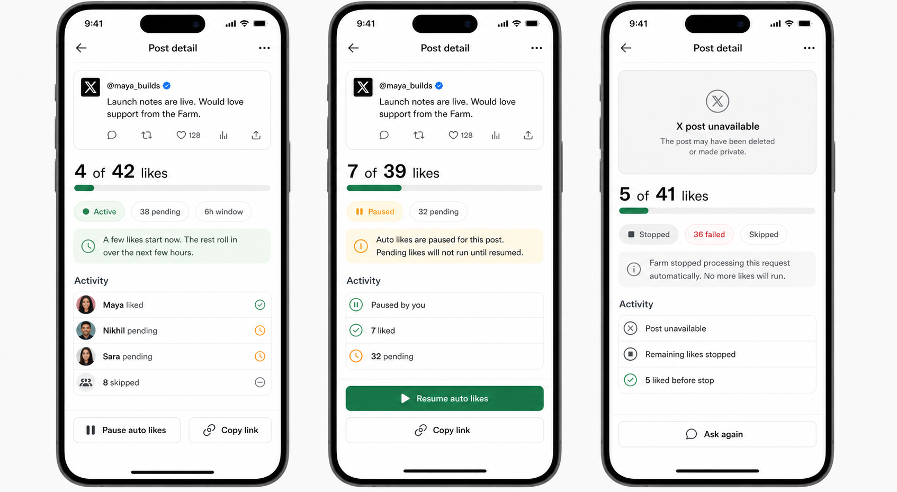

# Auto Engage

Status: Draft

## Purpose

Define the Convex-native backend worker that processes Farm engagement requests
and likes X posts through eligible linked X accounts.

This feature matters because request creation and request status are only useful
if Farm can perform the promised work durably, visibly, and within clear product
guardrails. Users should see a request move from pending to settled status
without needing to understand queues, retries, X API errors, or worker logs.

Auto Engage should support trusted private Farms, not a public engagement
marketplace. The worker must use official X APIs only, avoid incentives or
reciprocity mechanics, cap the size of each request, and stop within a fixed
processing window.

## Current Scope

- Replace the current narrow synchronous like pass after Home request creation
  with Convex scheduled functions/actions.
- Keep `engagementRequests` and `engagementAttempts` as the durable source of
  truth for request state, per-member outcomes, and live UI updates.
- Process likes for active members of the selected private Farm only.
- Use eligible linked X accounts only: account is linked, has usable access and
  refresh token material, and includes `tweet.read users.read like.write`.
- Select a variable, deterministic subset of eligible linked accounts for each
  request. The target should be roughly 90% for normal-sized Farms, but the
  hard cap of 50 is a ceiling, not the target.
- Preserve small-Farm behavior:
  - `1-3` eligible accounts: select all.
  - `4-10` eligible accounts: select all or drop one, determined by the
    request seed.
  - `11+` eligible accounts: select a seeded ratio near 90%, then apply the
    per-request effective cap.
- For Farms large enough to hit the 50-attempt ceiling, derive a per-request
  effective cap below or equal to 50, for example 35-50 selected attempts, so
  large requests do not all settle at exactly 50 Farm likes.
- Exclude the requester from the eligible candidate pool. Farm should not create,
  schedule, count, or display an own-like attempt for the user who submitted the
  post.
- Stagger selected attempts with deterministic request/account jitter: one
  immediate attempt, a small early cohort in the first five minutes, and the
  remaining first attempts across the first three hours.
- Make the 6-hour request window a hard cap. No attempt or retry may continue
  after the request deadline.
- Mark members who are missing X, ineligible, not selected by the cohort, or
  above the variable per-request cap as skipped in the user-facing request
  status.
- Handle retryable X API failures, final failures, token revocations, and
  already-liked/idempotent outcomes.
- Keep request status live through existing Convex queries used by
  `docs/features/05_POST.md`.
- Document local, automated, and production end-to-end verification paths.

## Future Scope

- Optional member-by-member approval before Farm performs a like.
- Push notifications for request complete, partial failure, or reconnect-needed
  events.
- Farm admin moderation tools such as cancel request, remove member, or report
  request.
- Request/day cooldowns, Farm-level safety limits, and abuse scoring if usage
  warrants it.
- Configurable Farm policy for who may request engagement.
- LinkedIn or other platform workers.
- Additional engagement actions such as reposts, comments, bookmarks, follows,
  or DMs.
- Vercel Cron as a coarse external stuck-job watchdog if Convex-only recovery
  proves insufficient.
- Vercel Workflows for later complex chains such as multi-platform approvals,
  long-lived notification workflows, or human-in-the-loop orchestration.

## Non-Goals

- Do not build a public engagement marketplace, public Farm discovery, or paid
  engagement packages.
- Do not add incentives, rewards, leaderboards, streaks, reciprocity scores, or
  "owed likes" mechanics.
- Do not use scraping, browser automation, password sharing, non-official APIs,
  or any automation outside the official X API.
- Do not expose raw X OAuth tokens, raw X error payloads, rate-limit details, or
  worker internals to the browser.
- Do not show selected percentages, queue position, exact scheduled like times,
  retry schedules, jitter values, or policy internals in the UI.
- Do not manually deploy through Vercel as part of normal implementation;
  production deploys are automatic on GitHub push.
- Do not broaden X OAuth scopes beyond the approved minimal linking direction
  without an explicit product/security decision.

## Design

The approved Auto Engage mock is:

- `docs/mocks/06_AUTO_ENGAGE/post-detail-flow.png`



- Existing status spec: `docs/features/05_POST.md`
- Existing request-status component:
  `components/request-status-screen.tsx`
- Secondary density reference: `docs/mocks/request-status.png`

Key layout decisions:

- After the user clicks `Request` and selects a Farm, they land on
  `/requests/[requestId]`. The existing route exists today, but the surface
  should become the user-facing `Post detail` view shown in the approved mock
  rather than staying titled `Request status`.
- Post detail should be a mobile-first receipt: embedded X post first, large
  progress count, simple status pills, pacing copy, activity rows, and bottom
  actions.
- Use the existing X embed treatment already present in app surfaces when the
  post is available, with a muted unavailable-post card when the post is deleted,
  private, or otherwise unavailable.
- User-facing row states stay plain: `Liked`, `Already liked`, `Pending`,
  `No X linked`, `Skipped`, and `Failed`.
- Request-level states shown in the mock include active, paused, and stopped.
- Members skipped because of cohort selection or the variable cap should be
  displayed as generic `Skipped`; do not surface internal policy reasons.
- Active requests should show pacing copy: `A few likes start now. The rest
  roll in over the next few hours.`
- The first selected like should be scheduled immediately and a small early
  cohort should run within five minutes when eligible accounts and X API
  availability allow it. This is a UX/product pacing goal, not a guarantee that
  every request will receive a like within five minutes.
- Paused requests should show `Auto likes are paused for this post. Pending
  likes will not run until resumed.`
- Stopped/unavailable requests should show `Farm stopped processing this request
  automatically. No more likes will run.`
- Avoid automation-console language such as schedule, queue, jitter, retry
  worker, rate limit, cohort, or selection percentage.
- Use existing shadcn components already composed by the status screen. If any
  additional UI primitive is required, implementation agents must consult
  `$vercel:shadcn` and add the shadcn component with `pnpm`/`pnpm dlx` instead
  of hand-rolling a replacement.

Design approval status:

- `docs/mocks/06_AUTO_ENGAGE/post-detail-flow.png` is approved and should be
  used by implementation agents for active, paused, and stopped Post detail
  states.
- The mock's visible `6h window` chip is not approved product copy. Keep the
  six-hour deadline as internal behavior and use the pacing copy specified
  below instead.
- `docs/mocks/request-status.png` remains a secondary density reference only.

## Product Requirements

### User Problem

A Farm member asks a trusted private group to support an X post and needs Farm to
perform the likes reliably, without creating a confusing black box or an
open-ended automation process.

### Product Goal

Make each engagement request settle within six hours, with clear per-member
status, limited blast radius, and no incentive or marketplace mechanics.

### Primary User Journey: Request Processes Automatically

- Entry point: user submits a valid X post URL from Home and selects a Farm.
- User intent: ask the selected private Farm to like the X post.
- Steps:
  1. Home validates and canonicalizes the X post URL through the existing
     request-creation flow.
  2. Convex creates an `engagementRequests` row and one
     `engagementAttempts` row per active Farm member except the requester.
  3. Missing and ineligible X accounts become skipped immediately.
  4. Eligible linked accounts, excluding the requester, enter the candidate pool.
  5. Auto Engage deterministically selects the request cohort: small-Farm rule,
     seeded ratio near 90% for larger Farms, and a variable per-request cap
     that never exceeds 50 selected attempts.
  6. Convex schedules selected attempt jobs with one immediate attempt, a small
     early cohort in the first five minutes, and remaining first attempts within
     three hours while keeping the six-hour retry deadline.
  7. Each job calls the official X like endpoint and records the attempt
     outcome.
  8. The request-status page updates through Convex queries as attempts settle.
- System behavior:
  - Scheduling should happen in or immediately after the internal request
    creation mutation so the persisted request and queued work stay aligned.
  - Each selected attempt must reach a terminal status by the request deadline.
  - Aggregate request counts must be recalculated through shared lifecycle
    helpers/mutations after each attempt update.
- Success outcome: selected accounts settle as `liked` or `already_liked`, and
  the request becomes `completed`.
- Failure outcome: failed, skipped, or expired-window attempts are visible, and
  the request becomes `partial` or `failed`.
- Next destination: user stays on request status, opens Posts history, or starts
  another request.

### Secondary User Journey: Live Status During Staggering

- Entry point: user opens `/requests/[requestId]` while Auto Engage is running.
- User intent: understand whether Farm is still working and what has completed.
- Steps:
  1. The page loads request aggregates and member outcomes.
  2. Pending selected attempts appear as `Pending`.
  3. As Convex mutations record outcomes, the page updates counts and rows.
  4. When no pending/retryable attempts remain, the aggregate request status
     becomes terminal.
- System behavior:
  - The UI reads persisted request/attempt state only; it does not infer worker
    state from client timers.
  - Hidden internal reasons may be stored for audit/debugging, but visible copy
    stays simple.
- Success outcome: user sees current live progress without refreshing.
- Failure outcome: unavailable, unauthorized, deleted Farm, or request-not-found
  states remain owned by the request-status feature.
- Next destination: user may copy the status link, return Home, or view Posts.

### Secondary User Journey: Pause Or Resume Auto Likes

- Entry point: user opens Post detail for an active request.
- User intent: stop Farm from processing any more automatic likes for this post.
- Steps:
  1. User taps `Pause auto likes`.
  2. Convex records the request as paused.
  3. Scheduled pending like jobs no-op while the request is paused.
  4. Post detail updates to the paused state.
  5. User may tap `Resume auto likes`.
  6. Convex allows remaining pending jobs to continue only if the request is
     still before `engagementDeadlineAt`.
- System behavior:
  - Pausing does not undo completed likes.
  - Pausing stops future X like calls for that request.
  - Resume does not extend the six-hour processing window for v1.
  - Scheduled jobs must check request pause state immediately before any X call.
- Success outcome: user has visible post-level control over Auto Engage.
- Failure outcome: if pause/resume fails, the page should show a concise
  recoverable error and preserve the previous state.
- Next destination: user stays on Post detail.

### Secondary User Journey: Deadline Finalization

- Entry point: an attempt remains `pending` or `failed_retryable` near the
  six-hour deadline.
- User intent: get a final answer instead of indefinite pending status.
- Steps:
  1. The worker checks `engagementDeadlineAt` before scheduling or retrying.
  2. If a retry cannot run before the deadline, it is not scheduled.
  3. At or after the deadline, any remaining non-terminal selected attempts are
     finalized as `failed_final`.
  4. The request aggregate status is recalculated.
- System behavior:
  - Internal error code should be `engagement_window_expired`.
  - User-facing status should be `Failed`.
  - No later scheduled replay should revive a terminal attempt.
- Success outcome: request always settles within six hours.
- Failure outcome: if deadline cleanup itself fails, a due-at/deadline sweeper
  can retry finalization, but no X like should be attempted after the deadline.
- Next destination: user sees final status on request detail/history.

### Secondary User Journey: Post Deleted Or Unavailable

- Entry point: a scheduled like attempt receives an X response indicating the
  post was deleted, made private, or is otherwise unavailable.
- User intent: no action is required; user needs Farm to stop safely and explain
  what happened.
- Steps:
  1. Worker classifies the X response as final post-unavailable state.
  2. Convex marks the request stopped.
  3. Remaining pending/retryable attempts are finalized without calling X.
  4. Post detail shows the unavailable-post card and activity rows from the
     approved mock.
- System behavior:
  - Do not require user action to stop processing.
  - Do not expose raw X API payloads.
  - Do not retry deleted/private/unavailable post states unless a later feature
    explicitly adds manual retry.
- Success outcome: request stops automatically and no more likes run.
- Failure outcome: if finalization is interrupted, the deadline/sweeper path
  should still stop remaining attempts before any later X call.
- Next destination: user may start a fresh request only through the normal Home
  flow.

## UX Requirements

- Screen inventory:
  - Existing Home request submission remains owned by `docs/features/04_HOME.md`.
  - Existing `/requests/[requestId]` route remains the destination, but should
    be presented as `Post detail`.
  - Posts history remains owned by `docs/features/05_POST.md`.
  - No new top-level screen is required.
- Required UI states:
  - Request aggregate: active, completed, partial, failed, canceled.
  - Post-level control: active, paused, stopped.
  - Post availability: embedded preview available, unavailable/deleted/private.
  - Attempt row: liked, already liked, pending, no X linked, skipped, failed.
- Copy requirements:
  - Use plain product language, not queue/worker/rate-limit language.
  - Do not say "90% selected", "50 cap", "randomized cap", "cohort", or
    "jitter" in user-facing surfaces.
  - Screen title: `Post detail`.
  - Active pacing copy: `A few likes start now. The rest roll in over the next
    few hours.`
  - Pause action: `Pause auto likes`.
  - Resume action: `Resume auto likes`.
  - Paused copy: `Auto likes are paused for this post. Pending likes will not
    run until resumed.`
  - Unavailable post title: `X post unavailable`.
  - Unavailable post body: `The post may have been deleted or made private.`
  - Stopped copy: `Farm stopped processing this request automatically. No more
    likes will run.`
- Loading states:
  - Existing request-status loading behavior is sufficient.
- Empty states:
  - If no members were targeted, existing no-members copy is sufficient.
- Error states:
  - Failed attempts should not expose raw X responses.
  - Reconnect-needed account state should remain visible through Settings/Home
    account eligibility surfaces, not through worker logs.
- Accessibility:
  - Preserve existing semantic status labels and progressbar behavior.
  - Any new copy must fit the narrow mobile layout without overlap.
- Responsive behavior:
  - Mobile-first narrow app surface remains the default.
  - Desktop remains the same centered narrow product surface, not a dashboard.

## Technical Specification

### Frontend

- Reuse existing request status queries and UI from
  `components/request-status-screen.tsx`.
- Do not add a worker dashboard or admin console for v1.
- If `skipped_not_selected` or `skipped_cap_exceeded` are added as internal
  statuses, map them to the existing visible `Skipped` treatment.
- If the UI needs a small active-state line, implement it inside the current
  request-status layout using existing shadcn/Tailwind v4 tokens.
- Use `$frontend-skill` and `$vercel:shadcn` before any frontend changes.

### Backend

- Add a Convex-native Auto Engage module, for example `convex/autoEngage.ts`,
  with internal-only functions.
- Move external X like calls out of synchronous post-create processing and into
  scheduled internal actions.
- Keep sensitive token lookup/decryption and X API calls server-side only.
- Keep database writes in internal mutations. Actions should call mutations to
  reserve work and record outcomes.
- Scheduling should happen after request/attempt rows exist and should be
  idempotent if request creation is replayed or an existing duplicate request is
  reused.
- Use `ctx.scheduler.runAfter` for per-attempt or small-batch delayed work.
- For large Farms, prefer per-attempt jobs or small batches rather than a single
  long action; Convex actions have execution limits and should not hold the
  entire six-hour process open.
- Add a deadline finalizer path that can settle remaining non-terminal attempts
  after `engagementDeadlineAt`.
- Keep Vercel Cron out of the primary path. If added later, it should only call
  a secured endpoint or Convex function for coarse stuck-job detection.

### X API

- Use official X API endpoint `POST /2/users/:id/likes`.
- Use OAuth user context for the linked account performing the like.
- Required account capability is `tweet.read users.read like.write`; X requires
  the read scopes for the user-context like endpoint. Farm uses them only to
  identify the linked account id and like or unlike submitted post URLs.
- On `429`, prefer `x-rate-limit-reset` when present. Otherwise use
  exponential backoff plus deterministic jitter.
- On `5xx`, retry while a retry can still occur before the deadline.
- On `401`, mark the linked account `needs_reconnect` and final-fail the
  current attempt.
- On `403`, missing scope, expired token, revoked token, or unusable token
  material, final-fail the current attempt.
- If X returns a distinguishable already-liked/idempotent outcome, record
  `already_liked`. If not distinguishable, treat successful/idempotent like
  responses as `liked`.

### Selection Randomization

Randomization must be stable, auditable, and not client-controlled.

- Derive a server-side selection seed from stable request data, such as
  `requestId`, `farmId`, `providerPostId`, and an internal salt.
- Use the seed to rank eligible attempts, choose the selected count, and
  generate schedule jitter.
- Do not use `Math.random()` in a way that makes production outcomes impossible
  to reproduce during debugging.
- The seed must never come from the browser.
- The hard maximum remains 50 selected attempts, but large requests should use
  an effective per-request cap below or equal to 50.
- Recommended effective cap for large Farms: deterministic integer between 35
  and 50, inclusive, bounded by eligible count and six-hour throughput.
- Recommended ratio for `11+` eligible accounts before the cap: deterministic
  value near 90%, such as 82%-94%, rather than a fixed `0.9`.
- Selected count formula should be equivalent to:

```ts
const ratioTarget = seededRatio(0.82, 0.94, selectionSeed)
const cohortTarget = smallFarmTarget(eligibleCount, selectionSeed, ratioTarget)
const effectiveCap = seededInt(35, 50, `${selectionSeed}:cap`)
const selectedCount = Math.min(cohortTarget, effectiveCap, 50)
```

- `smallFarmTarget` should preserve small groups:
  - `1-3`: `eligibleCount`
  - `4-10`: `eligibleCount` or `eligibleCount - 1`, seeded
  - `11+`: `Math.round(eligibleCount * ratioTarget)`
- If eligible count is lower than the effective cap, normal small/ratio rules
  control the selected count.
- If eligible count is high enough that the ceiling would otherwise force every
  request to 50, the effective cap should vary the selected count across
  requests.
- Implementation agents may tune the exact ratio/cap ranges, but they must
  preserve the invariant that large requests do not always select exactly 50.

## Data Model

Existing tables remain the core model:

- `engagementRequests`
- `engagementAttempts`
- `accounts`
- `farmMemberships`

Recommended `engagementRequests` additions:

- `engagementDeadlineAt`: number. `createdAt + 6 hours`.
- `autoEngageStatus`: optional union such as `"active" | "paused" |
  "stopped" | "completed"`.
- `pausedAt`: optional number.
- `pausedByUserId`: optional `v.id("users")`.
- `resumedAt`: optional number.
- `stoppedAt`: optional number.
- `stopReason`: optional union such as `"post_unavailable" |
  "engagement_window_expired" | "canceled"`.
- `selectedAttemptCount`: number. Number of attempts selected for X like jobs.
- `maxSelectedAttempts`: optional number. Store `50` if useful for audit/debug.
- `effectiveSelectedAttemptCap`: optional number. Per-request cap derived from
  the request seed; never greater than `maxSelectedAttempts`.
- `selectionSeed`: optional string. Stable seed derived from request/farm/post
  identifiers for deterministic cohorting and reproducible debugging.
- `autoEngageStartedAt`: optional number.
- `autoEngageCompletedAt`: optional number.

Recommended `engagementAttempts` additions:

- `scheduledAt`: optional number. Planned first execution time for selected
  attempts.
- `startedAt`: optional number. First worker start time.
- `selectionStatus`: optional union such as `"selected" | "not_selected" |
  "cap_exceeded"` if product wants policy auditing without expanding visible
  statuses.
- `selectionRank`: optional number. Stable seeded rank used to order eligible
  attempts for cohort selection.
- `skipReason`: optional internal string/union for no-X, ineligible,
  not-selected, cap-exceeded, deadline-expired, or manual cancellation.

Status guidance:

- Keep existing visible statuses if possible.
- If schema expands with internal skipped statuses, update status read models so
  they collapse to visible `Skipped`.
- `failed_retryable` counts as active/pending for aggregate purposes until it
  retries or deadline finalization converts it to `failed_final`.
- Terminal attempt statuses are `liked`, `already_liked`, skipped variants, and
  `failed_final`.

Index guidance:

- Existing request and attempt indexes should remain.
- Add only indexes required by implementation:
  - attempt lookup by due/retry state if a sweeper uses table scans.
  - request lookup by active/deadline if deadline cleanup is batched.
- Avoid unbounded arrays on request rows. Attempt rows remain separate child
  records.

## Backend Functions

Exact names may vary, but implementation agents should keep this shape:

- `internal.requests.createVerifiedFromHome`
  - Creates request and attempt snapshot.
  - Computes `engagementDeadlineAt`.
  - Calls/schedules Auto Engage only for newly created requests, not reused
    duplicate requests unless duplicate handling explicitly requires resuming.

- `internal.autoEngage.enqueueRequest`
  - Loads request and pending/skipped attempt snapshot.
  - Builds eligible candidate pool, excluding the requester.
  - Applies small-Farm rule, seeded ratio selection, and variable per-request
    cap that never exceeds 50.
  - Marks unselected/capped eligible attempts as skipped.
  - Writes selected scheduling metadata.
  - Schedules the first selected attempt immediately and a small early cohort in
    the first five minutes.
  - Schedules remaining selected first attempts across the first three hours and
    schedules a six-hour deadline finalizer.

- `internal.autoEngage.performLike`
  - Accepts `attemptId`.
  - Reserves the attempt only if it is still processable, not paused, not
    stopped, and before deadline.
  - Reads account/token/request target through internal queries or mutations.
  - Calls official X like endpoint.
  - Records outcome through shared lifecycle mutation.
  - Schedules retry only when retry can occur before deadline.

- `internal.autoEngage.reserveAttempt`
  - Optional mutation to transition pending/retryable work into an in-progress
    shape and prevent double processing.
  - Must be idempotent and no-op for terminal attempts.

- `internal.autoEngage.recordAttemptOutcome`
  - Can reuse or extract existing `recordLikeAttemptResult`.
  - Must allow retryable attempts to transition to terminal statuses when a
    retry runs.
  - Must recalculate aggregate request counts and terminal request status.

- `internal.autoEngage.finalizeExpiredRequest`
  - Runs at/after `engagementDeadlineAt`.
  - Converts remaining `pending` or `failed_retryable` selected attempts to
    `failed_final` with internal code `engagement_window_expired`.
  - Recalculates request aggregates.

- `internal.autoEngage.pauseRequest`
  - Records post-level pause state.
  - Leaves completed likes untouched.
  - Causes scheduled jobs to no-op before calling X.

- `internal.autoEngage.resumeRequest`
  - Clears pause state only if the request is still before the deadline.
  - Reschedules or lets due pending work continue according to implementation
    choice, without extending `engagementDeadlineAt`.

- `internal.autoEngage.stopUnavailablePost`
  - Records stopped state with `stopReason: "post_unavailable"`.
  - Converts remaining pending/retryable selected attempts to terminal failed or
    skipped outcomes without more X calls.
  - Updates Post detail read model so the unavailable-post card can render.

- `internal.accounts.markXNeedsReconnect`
  - Existing account reconnect path should remain the central way to mark X
    accounts that fail with `401`.

Idempotency rules:

- Worker replay must not double-like if an attempt is terminal.
- Worker replay must not double-count aggregates.
- Reused duplicate requests must not create duplicate attempt rows.
- Any scheduled job that fires after the deadline must finalize/no-op, not call
  X.
- Any scheduled job that fires while a request is paused or stopped must no-op
  before token decryption or X API calls.

## Execution Plan

1. Re-read `AGENTS.md`, `docs/CONVEX.md`, and
   `convex/_generated/ai/guidelines.md`.
2. Inspect current `convex/schema.ts`, `convex/requests.ts`,
   `convex/accounts.ts`, and request-status components before editing; the
   worktree may contain parallel edits.
3. Add schema fields for request deadline, selected count, and optional attempt
   scheduling/internal skip metadata, pause/resume state, and stopped-post
   state.
4. Extract the existing X like helper and attempt aggregate update logic so it
   can be reused by scheduled workers.
5. Add `convex/autoEngage.ts` internal functions for enqueue, perform, retry,
   pause/resume, unavailable-post stop, and deadline finalization.
6. Update request creation to enqueue Auto Engage for newly created requests
   after request/attempt rows are durable.
7. Update `/requests/[requestId]` from the existing request-status surface into
   the approved `Post detail` surface, reusing route and data access patterns.
8. Update status read models only as needed to collapse internal skipped states
   into existing visible `Skipped`, expose pause/stopped state, and expose post
   unavailable state.
9. Add focused tests or test helpers for cohort selection, deadline behavior,
   retry decisions, and aggregate finalization.
10. Run local checks.
11. Verify the local app through `pnpm build && pnpm start` and the in-app
    Browser.
12. Push through the normal GitHub path when requested; trust automatic
    production deploy.
13. Run production E2E smoke checks after deployment.

Parallel-agent ownership suggestion:

- Agent A: schema, cohort selection, and scheduling metadata.
- Agent B: worker/action implementation, X response handling, retries, and
  deadline finalizer.
- Agent C: request-status read model mapping, UI copy if needed, and browser
  verification.
- Agent D: tests, Convex CLI checks, and production E2E checklist execution.

Agents are not alone in the codebase. They must not revert edits made by other
agents or by the user, and they must re-read files immediately before patching.

## Verification Plan

### Local Checks

- Re-read:
  - `docs/CONVEX.md`
  - `convex/_generated/ai/guidelines.md`
- Run build/type checks:
  - `pnpm build`
- For local app verification, do not use `pnpm dev` by default. Use:
  - `pnpm build && pnpm start`
- Use the in-app Browser for localhost flow verification.
- Use Convex CLI checks for request/attempt rows:
  - `pnpm exec convex run health:ping`
  - `pnpm exec convex data engagementRequests`
  - `pnpm exec convex data engagementAttempts`

### Automated Scenarios

- Selection never exceeds 50 selected attempts.
- `1-3` eligible accounts select all.
- `4-10` eligible accounts drop at most one.
- `11+` eligible accounts select a seeded ratio near 90% before the variable
  per-request cap.
- Large eligible pools do not repeatedly select exactly 50 attempts; the
  effective cap varies by request seed while never exceeding 50.
- Unselected eligible accounts become skipped.
- Cap-exceeded eligible accounts become skipped.
- Initial first-attempt schedules fit inside roughly the first three hours,
  leaving retry and deadline-finalization buffer.
- One selected attempt is scheduled immediately, and a small early cohort
  targets visible movement within five minutes when eligible accounts and X API
  availability allow it.
- Paused requests do not process pending X like jobs.
- Resumed requests continue only before the original six-hour deadline.
- Deleted/private/unavailable post responses stop remaining Auto Engage
  automatically.
- Retryable failures stop at the 6-hour deadline.
- Deadline finalization converts remaining pending/retryable attempts to
  `failed_final` with internal code `engagement_window_expired`.
- Expired, revoked, insufficient-scope, or missing-token accounts final-fail or
  skip without calling X.
- `401` marks the account `needs_reconnect`.
- `429` honors `x-rate-limit-reset` when possible.
- `5xx` retries only while before deadline.
- Worker replay does not double-like or double-count.
- Aggregate request status finalizes as `completed`, `partial`, `failed`, or
  `canceled`.
- Live status updates appear through existing Convex queries.

### Manual Local Browser Flow

1. Start production-like local app with `pnpm build && pnpm start`.
2. Open localhost in the in-app Browser.
3. Sign in with a QA Farm user.
4. Confirm Home request creation still gates on eligible linked X.
5. Submit a safe X post URL against a private QA Farm.
6. Confirm request detail opens immediately.
7. Confirm the screen title is `Post detail` and the embedded X post or
   fallback appears.
8. Confirm pacing copy explains likes will roll in over the next few hours.
9. Confirm pending/skipped rows appear before selected jobs settle.
10. Confirm rows and counts update as worker mutations record outcomes.
11. Tap `Pause auto likes` and confirm pending jobs no-op while paused.
12. Tap `Resume auto likes` and confirm pending work can continue before the
    deadline.
13. Confirm no internal cohort/cap/deadline language appears in the UI.

## Production E2E Plan

Production deploys are automatic on GitHub push. Do not manually deploy unless
explicitly asked.

### Deployment Checks

- Trust the GitHub-to-Vercel production deployment.
- Use Vercel CLI only for status/log checks when needed:
  - `vercel inspect $NEXT_PUBLIC_APP_URL --wait`
  - `vercel logs $NEXT_PUBLIC_APP_URL --no-follow`
- Use Convex production deployment `$CONVEX_DEPLOYMENT` from `docs/CONVEX.md`:
  - `pnpm exec convex run --deployment $CONVEX_DEPLOYMENT health:ping`

### Production Smoke Setup

- Use the in-app Browser against `$NEXT_PUBLIC_APP_URL`.
- Use `docs/TEST_USERS.md` as the canonical inventory for reusable AgentMail
  inboxes and Farm QA users. Live X smoke tests must use separately supplied,
  manually maintained, aged X test accounts.
- Do not create ad hoc personal-user smoke data when the reusable QA Farm users
  are available. Do not put passwords, AgentMail API keys, OAuth tokens,
  recovery codes, or magic links in tracked docs.
- AgentMail provisioning order:
  1. Onboard AgentMail with the human email used by the repo operator.
  2. Save the AgentMail API key only in ignored `.env.local`.
  3. Create or fetch the reserved QA inboxes named in ignored local env.
  4. Use AgentMail message reads to retrieve Farm verification emails.
- Production account provisioning order:
  1. Create each Farm account on `$NEXT_PUBLIC_APP_URL` with its matching
     AgentMail email.
  2. Do not automate new X account creation. The AgentMail-based X signup
     strategy failed because X blocked the fresh account and should not be
     retried by agents.
  3. Use existing aged X test accounts supplied by the user and sign into them
     manually when needed.
  4. Link each X account through Farm Settings using the existing Farm X OAuth
     app.
  5. Verify production Convex `accounts` rows have linked status, expected
     scopes, and non-expired token metadata without copying token values into
     docs or chat.
- Create or reuse a private QA Farm.
- Add all reusable QA Farm users from `docs/TEST_USERS.md` to the same private
  QA Farm before running Auto Engage smoke tests.
- Use real linked X test accounts only when the team intentionally wants live X
  likes.
- Submit a safe test X post URL from a test account.
- Avoid using personal, sensitive, customer, or high-visibility posts for smoke
  tests.

### Production Assertions

- Request detail shows pending/skipped rows immediately after submission.
- Post detail shows the embedded X post or unavailable-post fallback.
- Post detail shows the next-few-hours pacing copy.
- Pause auto likes stops future pending X calls for that post.
- Resume auto likes allows pending work to continue before the original
  deadline.
- Deleted/private/unavailable post state stops remaining work automatically.
- No more than 50 attempts are selected for like jobs.
- Large eligible pools vary selected count below or equal to 50 instead of
  landing at exactly 50 for every request.
- Missing, ineligible, unselected, or capped members appear as skipped.
- Selected attempts settle within six hours.
- No retry runs after the six-hour deadline.
- Final aggregate request counts match attempt rows.
- User-facing UI does not expose selection percentage, cap policy, exact
  schedule, jitter, rate-limit details, or raw X errors.
- Production Convex rows reflect the created request and attempts through
  targeted CLI queries, for example:
  - `pnpm exec convex run --deployment $CONVEX_DEPLOYMENT health:ping`
  - `pnpm exec convex data --deployment $CONVEX_DEPLOYMENT engagementRequests`
  - `pnpm exec convex data --deployment $CONVEX_DEPLOYMENT engagementAttempts`
- Clean up QA Farm/test artifacts where supported by product flows.

### Production Blockers To Record

- X API quota or pricing prevents live test likes.
- QA users do not have linked eligible X accounts.
- OAuth token has expired or needs reconnect.
- Vercel deployment did not finish.
- Convex production deployment is not `$CONVEX_DEPLOYMENT`.
- Browser verification cannot authenticate the QA user.
- Reusable Farm QA users in `docs/TEST_USERS.md` are not fully provisioned or
  able to receive AgentMail verification emails.
- Manually maintained aged X test accounts are not available or cannot be
  linked through Farm Settings.
- Manual X test-account sign-in or OAuth linking is blocked by CAPTCHA, phone
  verification, abuse review, or another human trust step.

## Acceptance Criteria

- Engagement attempts run only for members of the selected private Farm.
- Engagement attempts use official X APIs only.
- No request selects more than 50 like attempts.
- Selection follows the small-Farm, seeded ratio, and variable-cap cohort rules.
- Large requests do not all settle at exactly 50 Farm likes solely because the
  hard ceiling is 50.
- The request creator is excluded from target attempts, aggregate stats, and
  activity rows. Legacy self-attempt rows are not selected, reserved, counted,
  or shown.
- Each selected attempt settles within six hours.
- No retry or like call runs after `engagementDeadlineAt`.
- Retryable failures use bounded retry policy and become terminal by deadline.
- Failed, skipped, pending, liked, and already-liked outcomes are visible to the
  app.
- Internal not-selected/capped/deadline details are not exposed in user-facing
  UI.
- `/requests/[requestId]` renders as `Post detail` and includes the approved
  active, paused, and stopped/unavailable states.
- Active Post detail explains that some likes start quickly and the rest happen
  over the next few hours.
- Post-level pause prevents future pending automatic likes from running.
- Resume continues pending work only before the original six-hour deadline.
- Deleted/private/unavailable post handling stops remaining automatic likes
  without requiring user action.
- Attempt updates flow through shared lifecycle helpers/mutations that keep
  request counts and terminal status consistent.
- Worker replay is idempotent and does not double-count.
- Farm has no incentives, public marketplace behavior, or engagement packages.
- Production E2E plan is documented and can be followed by implementation
  agents after push.
- Production E2E references `docs/TEST_USERS.md` as the source of truth for
  reusable AgentMail/Farm QA identities and the manual aged-X-account testing
  requirement.

## Agent Handoff

- This is a backend-first feature with a small read-model/UI mapping surface.
- Read `docs/CONVEX.md` and `convex/_generated/ai/guidelines.md` before editing
  Convex code.
- Use the repo-local Convex skill for Convex implementation choices.
- Use the X skill for endpoint, auth, and rate-limit handling.
- Use the repo-local `$agentmail` skill and `docs/TEST_USERS.md` before creating
  or using reusable Farm QA accounts. AgentMail is for Farm email inboxes only;
  do not automate fresh X account creation. Keep credentials and AgentMail API
  keys only in ignored `.env.local`.
- Use `$frontend-skill` and `$vercel:shadcn` before any frontend or shadcn UI
  changes.
- Use the in-app Browser for app verification.
- Use `pnpm` for all package commands.
- Use `pnpm build && pnpm start` for local app verification unless hot reload is
  explicitly needed.
- Do not edit `CLAUDE.md`.
- Do not manually deploy to production unless explicitly asked.
- Preserve existing dirty worktree changes. If unrelated files are modified,
  leave them alone. If touched files changed while working, re-read them and
  integrate with the current state rather than reverting.
- Keep `docs/PRD.md` updates lightweight: product direction and dated
  amendments only; this file remains the detailed Auto Engage spec.
